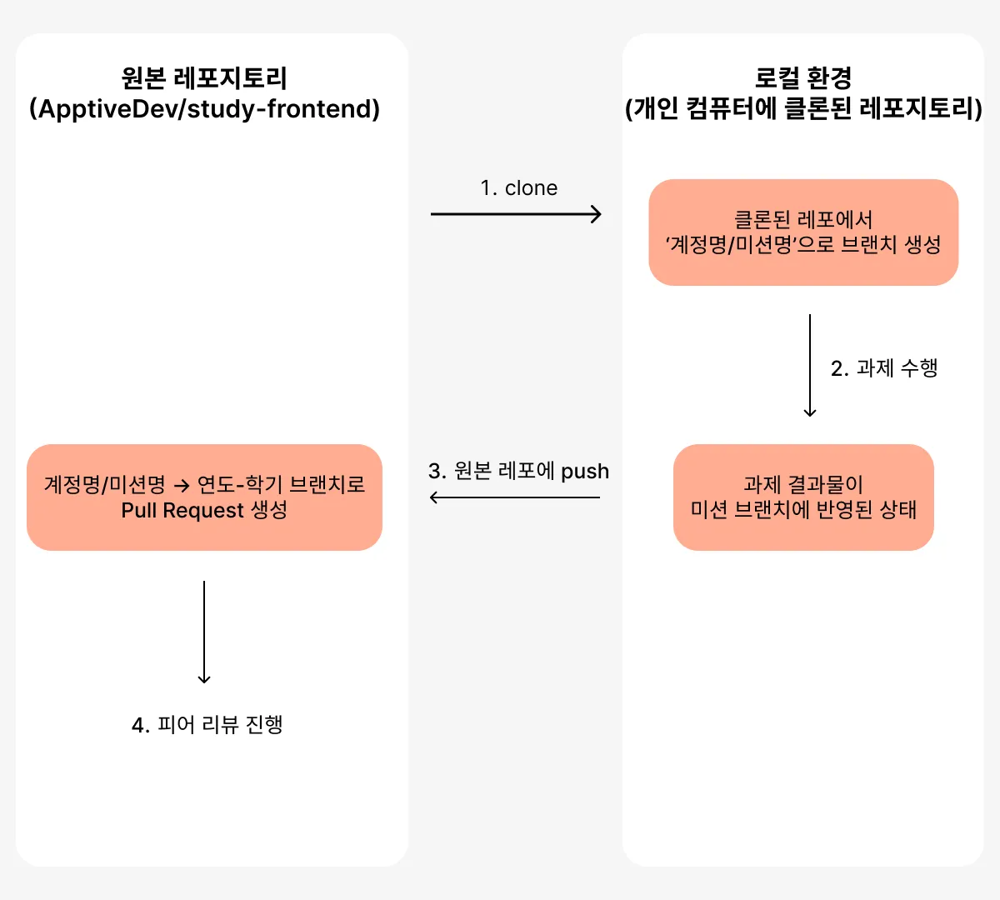
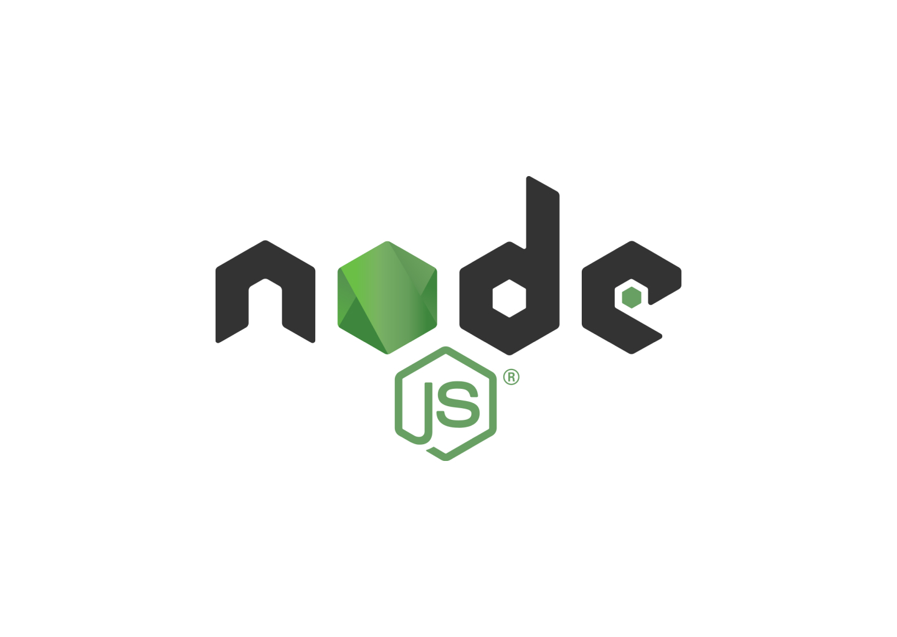
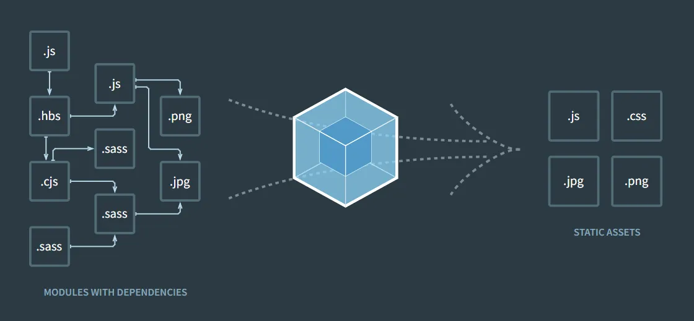

# 프로젝트 구조 및 기초 지식

## Git

### Git과 Github

#### Git

- 버전 관리 시스템 (Version Control System, VCS)
- 파일의 변경 이력을 관리하는 도구
- 협업 시 코드 충돌 방지 및 병합 지원

#### Github

- Git을 기반으로 한 웹 호스팅 서비스
- 많은 기업과 개발자들이 협업을 위해 원격 코드 저장소로 사용
- 이슈 트래킹, 코드 리뷰, 프로젝트 관리 등의 기능 제공

### 실습: Git/Github을 사용하여 과제 진행하기

앞으로의 스터디는 협업을 위해 Git/Github 사용법을 본격적으로 익히고, 코드리뷰를 포함한 협업 워크플로우에 익숙해지도록 Github Flow 방식으로 진행됩니다.

아래의 흐름에 따라 진행되니 **꼼꼼히 읽고 숙지해주세요**.



#### 과제 수행 전 (레포지터리 클론 및 브랜치 생성)

1. 레포지토리를 `git clone` 명령어를 이용해서 클론해주세요.
    ```sh
    git clone https://github.com/ApptiveDev/study-frontend.git
    ```
    
2. 위에서 클론한 프로젝트를 VS Code, Intellij IDEA 등 IDE로 열어주세요.

3. `본인 계정명/과제명`으로 브랜치를 생성한 후, 그 브랜치 위에 기능 단위로 커밋을 작성해주세요.
    1. `git checkout -b [브랜치 이름]` : 브랜치 생성 후 생성 브랜치로 이동
    2. `git add [파일명]`
    3. `git commit -m [커밋메시지]`

#### 과제 수행 후 (푸시 및 풀 리퀘스트 생성)

1. 작업이 완료된 브랜치를 원격 저장소에 푸시합니다.
    ```sh
    git push origin [브랜치 이름]
    ```

2. Github에서 해당 브랜치에 대한 Pull Request를 생성합니다.
    - PR 제목은 [기수] 이름 - n주차 과제로 설정해주세요.
    - Pull Request에는 다음 내용을 포함해주세요:
        - 어려웠던 점
        - 본인이 생각했을 때 과제에서 중요했던 내용
        - 그외 기타 질문

3. 멘토가 코드 리뷰를 진행한 후, 가장 알맞은 브랜치를 메인 브랜치에 머지합니다.
    > 모든 직군이 동시에 협업 스터디를 진행하기 때문에,
    > 학기/과제별로 단 하나의 작업 브랜치만 메인 브랜치에 머지되는 점을 유의해주세요.


## Node.js

### Node.js란?



Node.js는 JavaScript 런타임 환경입니다. 여러분이 Python을 사용하기 위해 Python 인터프리터를 설치하는 것처럼, JavaScript를 사용하기 위해서는 Node.js를 설치해야 합니다.

> #### JavaScript는 웹 브라우저에서 쓰는 언어가 아닌가요?
> 
> JavaScript는 원래 웹 브라우저에서 실행하도록 설계된 언어입니다. 하지만 Node.js가 등장하면서,
> 브라우저 밖에서도 JavaScript를 실행할 수 있게 되었습니다. 즉, Node.js는 브라우저 없이도
> JavaScript를 실행할 수 있게 해주는 환경입니다.

#### Node.js 설치하기

Node.js는 [공식 홈페이지](https://nodejs.org/)에서 설치할 수 있습니다. LTS(Long Term Support) 버전을 설치하는 것을 권장합니다.

### NPM(Node Package Manager)

NPM은 Node.js의 패키지 관리자입니다. NPM을 사용하면 다양한 오픈 소스 라이브러리를 쉽게 설치하고 관리할 수 있습니다. Python의 `pip`와 유사한 역할을 합니다.

### 번들러

다음의 코드를 봅시다. **지금은 코드 자체를 이해할 필요는 없습니다.**

```jsx
import { useState } from 'react';

function App() {
	const [data, setData] = useState({
		id: 1,
		name: 'My Fancy Name',
	});

	const handleChangeName = (e) => {
		setData({
			...data,
			name: e.target.value,
		});
	};
	
	return (
		<div>
			<h1>Current Name: {data.name}</h1>
			<input
				type="text"
				value={data.name}
				onChange={handleChangeName}
				placeholder="Enter new name"
			/>
		</div>
	);
}

export default App;
```

이렇게 사용자의 입력에 따라 `name` 데이터가 바뀌는 간단한 애플리케이션이 완성되었습니다.

하지만, 이 애플리케이션을 브라우저에서 바로 동작시킬 수는 없습니다. 브라우저는 jsx 문법을 알아듣지 못할 뿐더러, 위의 애플리케이션을 실제 dom에 렌더링하려면 ReactDOM과 같은 라이브러리를 불러와야 하기 때문이죠.



이러한 문제를 해결하기 위해, 우리는 **번들러(Bundler)** 라는 도구를 사용합니다. 번들러는 여러 개의 파일을 하나로 묶어주고, 최신 문법을 구형 브라우저에서도 동작할 수 있도록 변환해주는 역할을 합니다.

### 실습: Vite로 React 프로젝트 생성하기

[Vite](https://ko.vite.dev)는 빠르고 간편한 번들러입니다. Vite를 사용하여 React 프로젝트를 생성하여 봅시다.

1. 터미널을 열고, 위의 `Git` 섹션에서 클론한 레포지터리로 이동합니다.
    ```sh
    cd study-frontend
    ```

2. 과제용 디렉터리를 생성하고, 그 디렉터리로 이동합니다.
    ```sh
    cd projects
    mkdir $과제명
    cd $과제명
    ```

3. Vite를 사용하여 React 프로젝트를 생성합니다. JavaScript + SWC + React 템플릿을 사용합니다.
    ```sh
    pnpm create vite@latest .
    ```

4. 생성한 프로젝트의 의존성을 설치합니다.
    ```sh
    pnpm install
    ```

5. 개발 서버를 실행합니다.
    ```sh
    pnpm dev
    ```

## 조사해보기

- 트랜스파일링, 번들링, 폴리필은 어떤 작업인가요? 필요한 이유는 무엇일까요?
- 대표적인 번들러와 자바스크립트 트랜스파일러에는 어떤 것들이 있을까요?
- npm 외의 다른 패키지 매니저에는 어떤 것들이 있을까요? npm에 비해 갖는 장점은 무엇일까요?
- 프로젝트를 생성했을 때 나오는 각 파일들은 어떤 역할을 하나요?
- src 폴더는 우리가 만들 웹 애플리케이션의 소스 모듈이 위치한 곳입니다. src 내부의 폴더 구조를 어떻게 설정할 수 있을까요? 다양한 방법을 조사해주세요.

## 과제: React를 사용한 웹 문서 작성에 익숙해지기

- src 내부의 엔트리 파일(index.tsx), vite-env.d.ts 외의 파일들은 모두 제거해주세요. 그리고 index.tsx에서 삭제된 파일을 사용하는 코드들을 모두 제거해주세요.
- 간단한 자기소개 웹 페이지를 만들어봅시다. (예: 이름, 사진, 소개글, 연락처 등)
