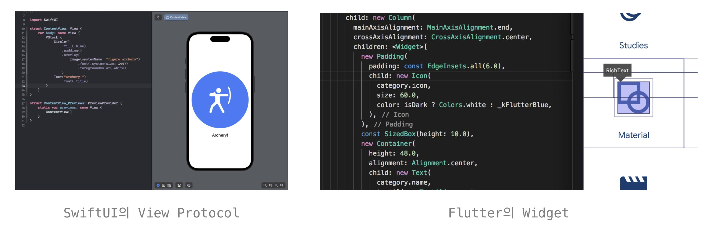
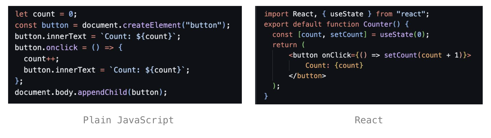
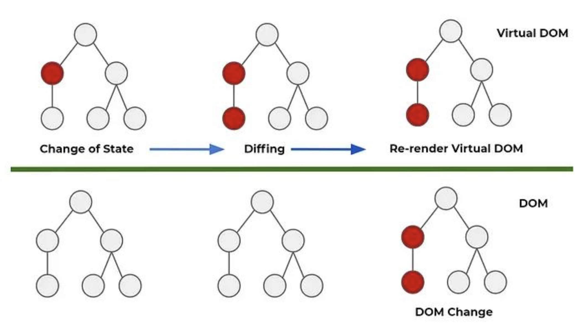
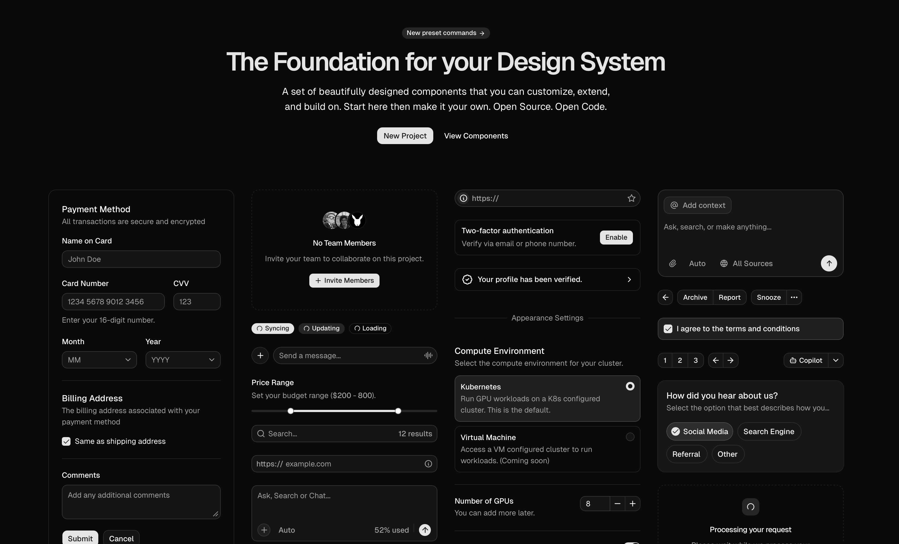
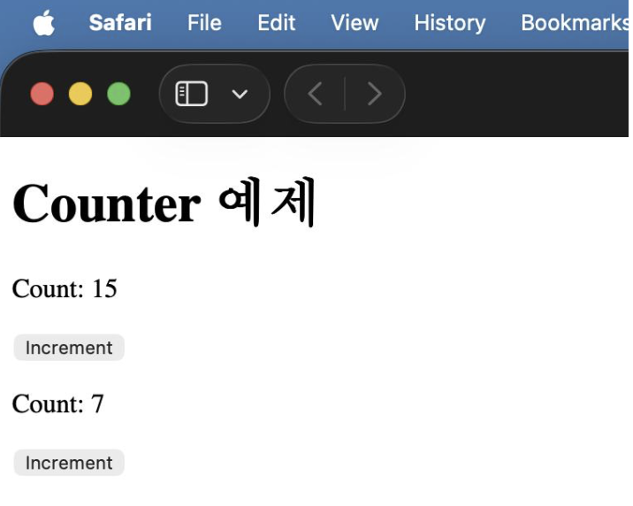
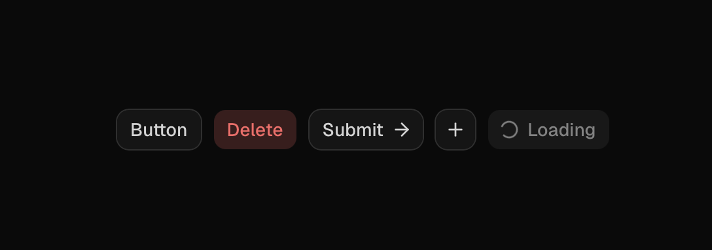

# Welcome to React

## React를 배우는 이유

### 웹 기술의 높은 확장성

- **JavaScript 생태계**: 압도적인 개발자 풀을 기반으로 한 훌륭한 생태계를 보유하고 있으며, NPM 라이브러리를 통해 React용 범용 UI 키트 (컴포넌트, 아이콘 등의 디자인 시스템)이 널리 배포된다.
- **웹 기술의 범용성**: 브라우저를 구동할 수 있는 OS라면 어떤 곳에서든 사용할 수 있다. (모바일 OS, 임베디드 등) 또한 경량화 JavaScript 엔진을 탑재한 곳에서도 사용할 수 있다. (예: IoT 디바이스)

### 현대적인 문법



**JSX (JavaScript XML)**: React에서 사용하는 컴포넌트 아키텍처는 다른 프레임워크에서도 비슷한 형태로 사용되며, 이를 통해 다른 UI 기술에 대한 진입 장벽을 낮출 수 있다.



**상태 관리의 용이성**: React의 상태 관리 방식은 HTML을 조작하는 전통적인 방법보다 더 직관적이고 효율적이다. 상태 변화에 따른 UI 업데이트가 자동으로 이루어지므로 개발자가 직접 DOM을 조작할 필요가 없다.

## React에서 DOM을 다루는 방법

기존 Plain JavaScript 방식에서는 어플리케이션이 크고 복잡해지면서, 관리할 상태나 이벤트 핸들러의 개수가 늘어나면서 코드가 복잡해지고 유지보수가 어려워지는 문제가 발생한다.

반면 React가 채용한 Virtual DOM 방식에서는,



1. 웹 문서를 구성하는 컴포넌트를 JavaScript로 표현한다.
2. 상태가 변경되었을 때 변경된 부분을 추적한다.
3. 변경이 필요한 부분만 웹 문서에 반영(렌더링)한다.

### 성능

AngularJS와 같은 프레임워크는 상태가 변화하면 규칙에 따라 dom요소를 바로 업데이트한다. 반면 React는 상태가 변화하면 Vir tual DOM을 변경한 후, 변경사항을 추적하여 DOM에 반영한다. AngularJS에 비해여 두 단계나 더 많은 과정이 필요하며, 따라서 성능 자체가 React가 더 뛰어나다고 할 수는 없다.

다만, 실제 DOM에는 변경이 필요한 부분만 업데이트하기 때문에, 대규모 애플리케이션에서 성능이 향상될 수 있다. 또한, React는 효율적인 렌더링을 위해 최적화된 알고리즘을 사용하여 변경 사항을 최소화하려고 노력한다. AngularJS와 Flutter에 비한 약간의 성능적 비교 열위는 우수한 개발자 경험(DX)을 위한 트레이드오프인 셈이다.

## React 사용의 기본

### JSX

JavaScript에서 HTML과 유사하게 DOM을 다루기 위한 확장 문법이다. 내부에 JavaScript 표현식을 직접 삽입하여 동적인 UI를 쉽게 만들 수 있다.

```jsx
import React, { useState } from "react";

export default function Counter() {
  const [count, setCount] = useState(0);

  return (
    <div>
      <p>Count: {count}</p>
      <button onClick={() => setCount(count + 1)}>Increment</button>
    </div>
  );
}
```

JSX를 하나의 자료형으로 인식하면, 함수형 컴포넌트는 JSX를 반환하는 함수로 생각하자. JSX 자료형은 내부적으로 `React.createElement` 함수를 호출하여 React 요소를 생성한다. 이 요소는 React가 DOM에 렌더링할 때 사용된다.

```ts
export default function Counter(): JSX.Element {}
```

### 컴포넌트



컴포넌트(Component)는 '구성 요소'의 의미로, UI를 구성하는 독립적이고 재사용 가능한 단위를 말한다. 어플리케이션의 구성 요소라는 의미이다. 버튼, 체크박스, 입력 상자부터 로그인 Form, 우클릭 메뉴, 결제 팝업 등을 모두 컴포넌트로써 표현하고 관리할 수 있다.

React에서의 컴포넌트는 특히 재사용성에 초점을 맞추고 있다. 컴포넌트를 잘 설계하면, 어플리케이션의 여러 부분에서 동일한 컴포넌트를 재사용할 수 있어 개발 효율성이 크게 향상된다. 또한, 컴포넌트는 독립적으로 개발되고 테스트될 수 있기 때문에, 유지보수와 확장성 측면에서도 유리하다.

```jsx
import Counter from "./components/counter";

export default function App() {
  return (
    <div>
      <h1>Counter 예제</h1>
      <Counter />
      <Counter />
    </div>
  );
}
```

위의 Counter 컴포넌트는 App 컴포넌트에서 XML 요소로써 삽입되었으며, 원하는 만큼 Counter 컴포넌트를 삽입하여 사용할 수 있다.



또한 컴포넌트 내에서 사용되는 `useState` hook은, 사용된 컴포넌트 인스턴스별로 독립적인 상태를 관리하도록 설계되어 있다. 위의 사진에서도 Counter 컴포넌트가 2개 사용되었지만, 독립적인 상태를 가진 것을 확인할 수 있다.

### State

React의 함수형 컴포넌트는 `useState`를 사용해서 상태를 관리한다. 이를 통해 컴포넌트 내부에서 동적인 데이터를 관리할 수 있으며, 상태가 변경될 때마다 컴포넌트가 자동으로 다시 렌더링되어 UI가 업데이트된다.

```jsx
const [count, setCount] = useState(0);
```

useState의 반환값은 파이썬에서의 `Tuple`과 유사한 형태이다. 첫 번째 요소는 현재 상태의 값에 대한 참조, 두 번째 요소는 상태를 업데이트하는 함수(Dispatcher)에 대한 참조이다. `setCount` 함수를 호출하여 상태를 업데이트하면, React는 변경된 상태를 감지하고 컴포넌트를 다시 렌더링하여 UI를 최신 상태로 유지한다.

#### 그냥 count를 직접 변경하는 것은 왜 안 될까?

count를 직접 변경하도 값은 변경됩니다. 하지만 `setCount`를 경유하지 않으면, React가 상태가 변경된 것을 감지할 수 없어, UI를 업데이트하지 않기 때문에, 변경된 값이 화면에 반영되지 않습니다.

#### Dispatcher는 비동기적이다

`setCount`와 같은 상태 업데이트 함수는 비동기적으로 동작한다. 즉, 상태 업데이트가 즉시 반영되지 않고, React가 최적화된 방식으로 상태 변경을 처리하기 위해 일괄적으로 업데이트를 수행하기 때문이다. `setCount`는 상태 업데이트를 예약하는 역할이다.

```jsx
const [count, setCount] = useState(0);

function increment() {
  setCount(count + 1);
  console.log(count); // 여전히 이전 상태의 값이 출력됨
}
```

### Props

Props는 '속성'의 의미로, 컴포넌트에 전달되는 데이터나 설정을 나타낸다. 함수형 컴포넌트의 개념에 입각하면, Props는 컴포넌트의 파라메터로 생각할 수 있다. 이를 통해 컴포넌트의 세부적인 동작이나 스타일을 외부에서 제어하여, 재사용성을 더욱 높일 수 있다.



```jsx
import React from "react";
import Button from "@/components/ui/button";

export default function App() {
  return (
    <div>
      <h1>Props 예제</h1>
      <Button size="md" variant="primary">
        Primary Button
      </Button>
      <Button size="lg" variant="outline">
        Secondary Button
      </Button>
    </div>
  );
}
```

위의 예제에서 Button 컴포넌트는 `size`와 `variant`라는 Props를 받아서, 버튼의 크기와 스타일을 제어한다. 이를 통해 동일한 Button 컴포넌트를 다양한 방식으로 사용할 수 있다.

#### 데이터의 흐름

React에서는 데이터가 부모 컴포넌트에서 자식 컴포넌트로 단방향으로 흐르며, 반대 방향의 흐름은 생기지 않는다. 자식이 데이터를 쉽게 변경할 수 없도록 하여 데이터의 흐름을 단순화하기 위함이다.

큰 프로젝트를 진행하다 보면 필연적으로 여러 요소 간에 큰 의존성이 생기게 되는데, 양방향으로 데이터를 주고받는다면 어떤 컴포넌트가 어떤 데이터를 변경하는지 추적하기 어려워지고, 버그가 발생할 가능성이 높아진다.

```jsx
function Parent() {
  const [count, setCount] = useState(0);

  return (
    <div>
      <p>Count: {count}</p>
      <Child setCount={setCount} />
    </div>
  );
}
```

`useState`를 props로 전달하여 자식 컴포넌트에서 상태를 업데이트할 수 있도록 하는 패턴이 흔히 사용된다. 이를 통해 자식 컴포넌트가 부모 컴포넌트의 상태를 간접적으로 변경할 수 있지만, 여전히 데이터의 흐름은 단방향으로 유지된다.

## 조사해보기

- React는 Client Side Rendering 방식의 웹앱을 위한 UI 라이브러리입니다. Client Side Rendering이란 무엇일까요? 전통적인 SSR 방식의 웹앱과의 차이점은 무엇일까요?
- 앞서 리액트는 상태에 따른 선언적 프로그래밍이 가능하도록 돕도록 한다고 말씀드렸습니다. 선언적 프로그래밍과 명령형 프로그래밍의 차이는 무엇일까요?
- 브라우저가 웹 페이지를 표시하는 과정을 단계를 나누어 자세히 설명해주세요.
- 컴포넌트를 설계할 때 명확한 기준이 있다면 조금 더 수월한 설계가 가능합니다. 컴포넌트를 설계하고 나누는 기준에는 어떤 것들이 있을까요?
- 컴포넌트 간에는 부모-자식 관계가 존재할 수 있습니다. 어떨 때 부모-자식 관계가 성립하는 걸까요?
- **조건부 렌더링이란 무엇일까요? 어떨 때 사용할 수 있을까요? (중요)**

## 과제: todo 리스트 만들기

자세한 설명은 [해당 프로젝트](../../projects/1-react)를 참고해주세요.
