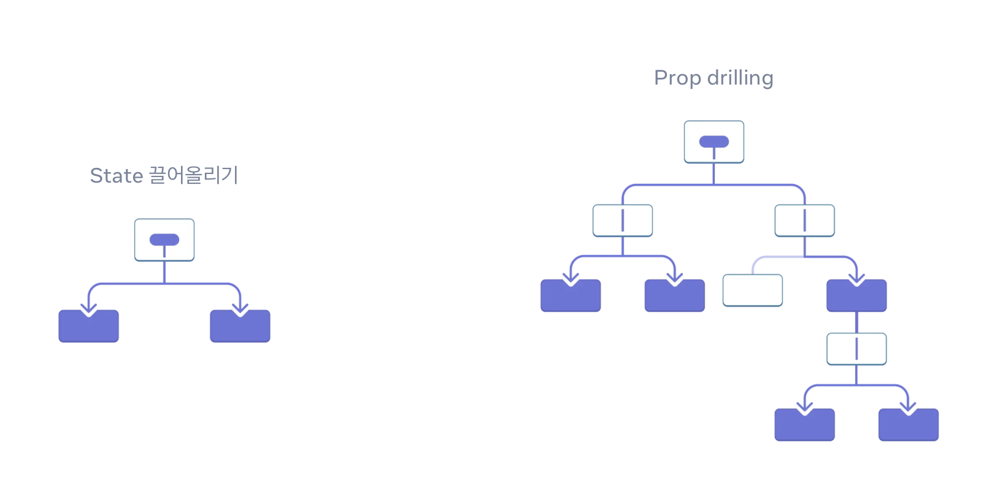
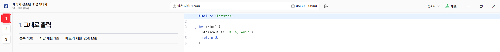
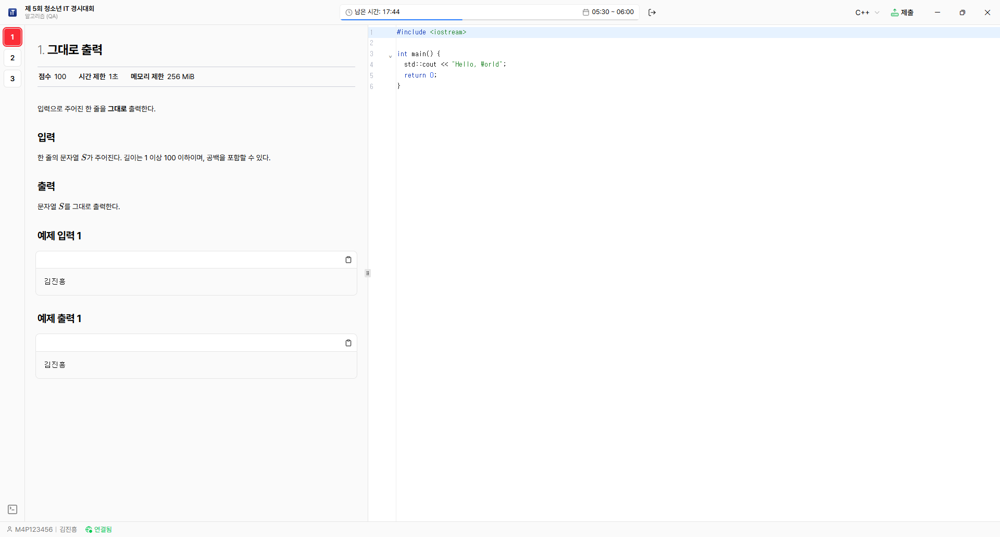

# Context와 컴포넌트 합성

## 이번 차시를 시작하기 전에...

### 1. `children` prop

`children`은 리액트 컴포넌트에서 특별하게 사용되는 prop으로, 컴포넌트의 **시작 태그**와 **종료 태그** 사이에 위치한 모든 요소들을 포함합니다. 즉 컴포넌트가 감싸고 있는, 컴포넌트 아래의 **자식 요소들**을 나타냅니다.

예를 들어, 다음과 같은 컴포넌트가 있다고 가정해봅시다:

```jsx
function Wrapper({ children }) {
  return <div className="wrapper">{children}</div>;
}
```

이 컴포넌트를 사용할 때, 다음과 같이 작성할 수 있습니다:

```jsx
function App() {
  return (
    <Wrapper>
      <h1>Hello, World!</h1>
      <p>This is a sample paragraph.</p>
    </Wrapper>
  );
}
```

위 예제에서 `Wrapper` 컴포넌트는 `children` prop을 통해 `<h1>`과 `<p>` 요소를 받아서, 이를 `<div>` 요소 안에 렌더링합니다. 결과적으로, 브라우저에는 다음과 같은 구조가 나타납니다:

```html
<div class="wrapper">
  <h1>Hello, World!</h1>
  <p>This is a sample paragraph.</p>
</div>
```

> #### 참고
>
> `children` prop은 리액트에서 자동으로 전달되므로, 별도로 명시하지 않아도 됩니다.
> 이는 내부적으로 다음과 같이 처리됩니다:
>
> ```jsx
> function App() {
>   return (
>     <Wrapper
>       children={[<h1>Hello, World!</h1>, <p>This is a sample paragraph.</p>]}
>     />
>   );
> }
> ```

### 2. ReactNode 타입

`children` prop의 타입은 일반적으로 `ReactNode`로 지정됩니다. `ReactNode`는 리액트에서 렌더링할 수 있는 모든 유형의 값을 포함하는 타입입니다. 여기에는 다음과 같은 것들이 포함됩니다:

- 문자열 (예: `"Hello, World!"`)
- 숫자 (예: `42`)
- JSX 요소 (예: `<div>Hello</div>`)
- 배열 (예: `[<div key="1">Item 1</div>, <div key="2">Item 2</div>]`)
- `null` 또는 `undefined` (렌더링되지 않음)
- `true` 또는 `false` (렌더링되지 않음)

다양한 타입의 값을 `children`으로 전달할 수 있기 때문에, `ReactNode` 타입은 매우 유연하게 사용됩니다. 배열 렌더링에서 `Array.map`을 사용하여 여러 요소를 생성할 수 있는 것도 이 덕분입니다.

### 3. Fragment

Fragment는 React에서 여러 Component를 DOM Element로 감싸지 않고도 그룹화할 수 있는 방법입니다.

React 컴포넌트는 반드시 하나의 최상위 요소만 반환할 수 있습니다. 2가지 이상의 요소를 반환하려고 하면 오류가 발생합니다.

```jsx
function MyComponent() {
  return (
    <h1>Hello, World!</h1>
    <p>This is a sample paragraph.</p> // 오류 발생!
  );
}
```

따라서 위와 같은 경우, 두 요소를 하나의 부모 요소로 감싸야 합니다. 일반적으로 `<div>`와 같은 HTML 요소를 사용하지만, React에서는 이렇게 사용할 수 있습니다:

```jsx
import { Fragment } from "react";

// 1. Fragment 컴포넌트 사용
function MyComponent() {
  return (
    <Fragment>
      <h1>Hello, World!</h1>
      <p>This is a sample paragraph.</p>
    </Fragment>
  );
}

// 2. 축약형 문법 사용
function MyComponent() {
  return (
    <>
      <h1>Hello, World!</h1>
      <p>This is a sample paragraph.</p>
    </>
  );
}
```

> #### 참고
>
> Fragment은 DOM에 추가적인 요소를 생성하지 않기 때문에, 스타일링이나 레이아웃에 영향을 주지 않습니다. 이는 불필요한 `<div>` 요소를 피하고자 할 때 유용합니다.

### 4. `key` prop

`key` prop은 리액트에서 각 요소를 고유하게 식별하기 위하여 사용하는 특별한 prop입니다.
일반적으로는 신경쓸 필요가 없지만, 배열을 렌더링할 때에는 반드시 설정해 주어야 합니다.

```jsx
function ItemList({ items }) {
  return (
    <ul>
      {items.map((item) => (
        <li key={item.id}>{item.name}</li> // key prop 설정
      ))}
    </ul>
  );
}
```

> #### 참고
>
> `key` prop은 모든 React 컴포넌트에 내장되어 있으며, 우리가 직접 접근할 수 없습니다.
> 따라서 `props.key`와 같이 접근하려고 하면 `undefined`가 반환됩니다.

### 5. Node.js의 패키지 매니저

Node.js에서 기본적으로 사용하는 패키지 매니저는 NPM (Node Package Manager)입니다. NPM은 Node.js와 함께 설치되며, JavaScript 패키지들을 쉽게 관리하고 설치할 수 있도록 도와줍니다.

최근에는 Yarn과 PNPM과 같은 대체 패키지 매니저가 Plug-n-Play(PnP), monorepo 지원, 훨씬 빠른 속도 등의 장점으로 큰 인기를 얻고 있으며, 우리 스터디의 예제 코드에서도 PNPM을 사용하고 있습니다.

현재 최신 버전의 Node.js LTS에서 이를 활성화하는 방법은 다음과 같습니다. Windows 환경을 기준으로 설명드립니다.

1. PowerShell을 관리자 권한으로 실행합니다.
2. 다음 명령어를 입력하여 PNPM 및 Yarn을 활성화합니다.
   ```bash
   corepack enable
   ```

### React State로 Input 요소 다루기

React에서 Input 요소를 다루는 방법에는 두 가지 주요 방식이 있습니다.

1. **제어 컴포넌트 (Controlled Component)**: Input 요소의 값이 React State에 의해 제어되는 방식입니다. 사용자가 입력할 때마다 `onChange` 이벤트 핸들러를 통해 State를 업데이트합니다.

   ```jsx
   import { useState } from "react";

   function ControlledInput() {
     const [value, setValue] = useState("");

     function handleChange(event) {
       setValue(event.target.value);
     }

     return <input type="text" value={value} onChange={handleChange} />;
   }
   ```

2. **비제어 컴포넌트 (Uncontrolled Component)**: Input 요소의 값이 DOM에 의해 관리되는 방식입니다. React State를 사용하지 않고, Form Event를 활용하여 값을 읽어옵니다.

   ```jsx
   import { useRef } from "react";

   function UncontrolledInput() {
     const inputRef = useRef(null);

     function handleSubmit(event) {
       event.preventDefault();
       alert(`Input value: ${inputRef.current.value}`);
     }

     return (
       <form onSubmit={handleSubmit}>
         <input type="text" ref={inputRef} />
         <button type="submit">Submit</button>
       </form>
     );
   }
   ```

## Context API란

### Context API의 필요성

<figure style="width:100%;margin-left:0;margin-right:0;">
    
    <figcaption style="color:gray">Props Drilling (출처: <a href="https://ko.react.dev/learn/passing-data-deeply-with-context">React 공식문서</a>)</figcaption>  
</figure>

여러분이 컴포넌트를 많이 쌓으면 쌓을수록, Props를 통해 데이터를 전달하는 것이 점점 더 복잡해집니다.

하나의 Page를 구성한다고 생각해 봅시다.

```
Page
 ├── Header
 ├── Content
 │    └── PostList
 │         └── PostItem
 │              └── LikeButton
 └── Footer
```

이 때, Page 컴포넌트에서 Post의 ID를 보유하고 있고, 이를 `LikeButton` 컴포넌트에서 사용해야 한다고 가정해 봅시다. 이 경우, `Post ID`를 `LikeButton` 컴포넌트에 전달하기 위해서는 다음과 같이 Props를 통해 데이터를 전달해야 합니다:

```jsx
function Page() {
    const postId = 1;

    return (
        <Header />
        <Content postId={postId} />
        <Footer />
    )
}

function Content({ postId }) {
    return (
        <PostList postId={postId} />
    )
}

function PostList({ postId }) {
    return (
        <PostItem postId={postId} />
    )
}

function PostItem({ postId }) {
    return (
        <LikeButton postId={postId} />
    )
}

function LikeButton({ postId }) {
    // postId 사용
}
```

Post ID를 버튼에 전달하기 위해서 중간에 있는 모든 컴포넌트들을 거쳐야 합니다. 이처럼 불필요하게 많은 컴포넌트들이 Props를 전달하는 역할만 하게 되는 현상을 **Props Drilling**이라고 부릅니다. 이는 코드의 가독성을 떨어뜨리고 유지보수를 어렵게 만듭니다.

<figure style="width:100%;margin-left:0;margin-right:0;">
<a href="https://youtu.be/3MB8DBXzEos">

</a>
<figcaption style="color:gray">영상: 리액트 코드짜는법</figcaption>
</figure>

### Context API의 개념

Context API는 Prop drilling 문제를 해결하기 위해 React에서 제공하는 기능입니다.
하나의 부모 컴포넌트에서 **트리 아래의 모든 자식 컴포넌트들**에 데이터를 전달할 수 있도록 해줍니다. 이를 통해 중간 컴포넌트들이 Props를 전달하는 역할을 하지 않아도 됩니다.

Context는 두 가지 주요 컴포넌트로 구성됩니다:

1. `Provider`: Context의 값을 제공하는 컴포넌트입니다. 이 컴포넌트는 Context를 구독하는 모든 하위 컴포넌트들에게 값을 전달합니다.
2. `Consumer`: Context의 값을 사용하는 컴포넌트입니다. 이 컴포넌트는 Context의 값을 구독하여 사용할 수 있습니다.

### 실습: Context API 사용하기

다크 모드 기능은 2020년 이후로 많은 웹사이트에서 기본적으로 제공되는 기능이 되었습니다.
이를 구현하기 위해 최상위 컴포넌트에서 `isDarkMode` 상태를 관리한다고 가정합시다.

```jsx
import React, { useState } from "react";

function App() {
  const [isDarkMode, setIsDarkMode] = useState(false);

  function toggleTheme() {
    setIsDarkMode((prevMode) => !prevMode);
  }

  return (
    <div className={isDarkMode ? "dark-mode" : "light-mode"}>
      <MyComponent isDarkMode={isDarkMode} toggleTheme={toggleTheme} />
    </div>
  );
}
```

이 때, 모든 컴포넌트에 `isDarkMode`와 `toggleTheme`를 Props로만 전달해야 한다면 정말 극단적인 Prop drilling이 발생할 것입니다. 이를 해결하기 위해 Context API를 사용해 봅시다.

```jsx
// theme.jsx
import React, { createContext, useState, useContext } from "react";

// 1. Context 생성
const ThemeContext = createContext();

// 2. Provider 컴포넌트 생성
export function ThemeProvider({ children }) {
  const [isDarkMode, setIsDarkMode] = useState(false);

  function toggleTheme() {
    setIsDarkMode((prevMode) => !prevMode);
  }

  const value = {
    isDarkMode: isDarkMode,
    toggleTheme: toggleTheme,
  };

  return (
    <ThemeContext.Provider value={value}>{children}</ThemeContext.Provider>
  );
}

// 3. Custom Hook 생성
export function useTheme() {
  const context = useContext(ThemeContext);
  if (context === undefined) {
    throw new Error("useTheme must be used within a ThemeProvider");
  }
  return context;
}
```

### 원리

이 실습에서 우리는 다음과 같은 단계를 거쳤습니다.

1. `createContext`를 사용하여 `ThemeContext`를 생성했습니다.
   ```jsx
   const context = useContext(ThemeContext);
   ```
2. `ThemeProvider` 컴포넌트를 만들어, `isDarkMode` 상태와 `toggleTheme` 함수를 Context의 값으로 제공했습니다.

   ```jsx
   export function ThemeProvider({ children }) {
     // ...

     return (
       <ThemeContext.Provider value={value}>{children}</ThemeContext.Provider>
     );
   }
   ```

3. App 컴포넌트에서 `ThemeProvider`로 컴포넌트 트리를 감싸, Context의 값을 하위 컴포넌트들이 사용할 수 있도록 했습니다.
   ```jsx
   export function App() {
     return (
       <ThemeProvider>
         <MyComponent />
       </ThemeProvider>
     );
   }
   ```
4. `useTheme`라는 Custom Hook을 만들어, Context의 값을 쉽게 사용할 수 있도록 했습니다.
   ```jsx
   export function MyComponent() {
     const { isDarkMode, toggleTheme } = useTheme(); // useContext(ThemeContext)
     // ...
   }
   ```

이 때, 컴포넌트 트리의 구조는 다음과 같습니다:

```jsx
App
 └── ThemeProvider
      └── ThemeContext.Provider
           └── MyComponent
```

`MyComponent`에서 `useContext` 훅을 사용하면, 상위의 `ThemeContext.Provider`을 탐색한 후 그 값을 가져오게 됩니다. Context라는 단어 그대로, 컴포넌트 트리의 맥락에 따라 값을 전달받는 것입니다.

### Context API는 전역 상태 관리 도구인가?

Context API는 전역 상태 관리 도구처럼 보일 수는 있지만, 실제로는 그렇지 않습니다.

- Context API는 컴포넌트 트리 내에서만 값을 전달합니다. 즉, Context Provider로 감싸지지 않은 컴포넌트에서는 해당 Context의 값을 사용할 수 없습니다.
  ```jsx
  function App() {
    return (
      <Fragment>
        <ThemeProvider>
          <MyComponent /> {/* ThemeContext 사용 가능 */}
        </ThemeProvider>
        <AnotherComponent /> {/* ThemeContext 사용 불가 */}
      </Fragment>
    );
  }
  ```
- Context API의 사용 목적은 Props Drilling 문제를 해결하여 여러 컴포넌트의 상태 공유를 용이하게 하는 것입니다. 즉, **Props 전달을 간소화**하는 것이 주된 목적입니다.

그러나 Theme과 사용자 로그인 정보 등, 어플리케이션에서 사용되는 전역적인 상태를 관리하는 데에 역시 유용하게 사용할 수 있는데, 이는 React의 특성에 기인합니다:

- React로만 제작하는 어플리케이션의 Entrypoint는 사실상 React 함수형 컴포넌트입니다.
- 최상위 컴포넌트를 Context Provider로 감싸면, 어플리케이션 전체에서 Context 값을 사용할 수 있습니다.

따라서, 우리가 진행할 프로젝트에서는 Redux와 같은 별도의 전역 상태 관리 도구를 사용하지 않고, Context API를 활용하여 전역 상태를 관리할 것입니다.

## 컴포넌트 합성

컴포넌트 합성(Component Composition)은 리액트에서 컴포넌트를 재사용하고 조합하는 방법을 의미합니다. 컴포넌트 합성을 통해 복잡한 UI를 더 작은 단위의 컴포넌트로 나누고, 이를 조합하여 전체 UI를 구성할 수 있습니다.

웹 어플리케이션의 헤더를 구성하면서, 페이지 별로 표시되는 요소가 약간씩 달라지는 상황이 발생한다고 가정해 봅시다. 제가 개발했던 시험 응시 시스템에서는, 알고리즘 시험에서는 코드 제출 버튼이 상단에 표시되어야 하고, 일반 시험에서는 관련 기능이 없었습니다.

<figure style="width:100%;margin-left:0;margin-right:0;">
    
    
    <figcaption style="color:gray">알고리즘 시험 화면에는 제출 버튼이 존재한다.</figcaption>  
</figure>

이를 해결하기 위해, 우리는 컴포넌트 합성을 활용할 수 있습니다. 예를 들어, `Header` 컴포넌트를 만들고, 이 컴포넌트가 `children` prop을 통해 페이지 별로 다른 요소를 받아들이도록 할 수 있습니다.

```jsx
export function Header({
  children,
  className,
  ...props
}: HTMLAttributes<HTMLDivElement>) {
  return (
    <header
      {...props}
      className={cn(
        "items-center bg-sidebar border-b border-sidebar-border flex h-[48px]",
        !focused && "text-muted-foreground",
        className
      )}
    >
      {children}
    </header>
  );
}
```

그리고 모든 페이지에 공통적으로 사용되는 헤더 컴포넌트를 다음과 같이 작성할 수 있습니다:

```jsx
export function HeaderSide({
  children,
  className,
  ...props
}: HTMLAttributes<HTMLDivElement>) {
  return (
    <div
      className={cn("flex-1 flex self-stretch items-center", className)}
      {...props}
    >
      {children}
    </div>
  );
}

export function HeaderTitle() {
  return; // ...;
}

export function HeaderTimer() {
  return; // ...;
}

export function HeaderExitButton() {
  return; // ...;
}

export function HeaderWindowControls() {
  return; // ...;
}
```

마지막으로, 각 페이지에서 헤더를 다음과 같이 조합하여 사용할 수 있습니다:

```jsx
<Header>
  <HeaderTitle />

  <HeaderTimer />
  <HeaderExitButton />

  <HeaderSide className="justify-end">
    <AlgorithmToolbar /> {/* 알고리즘 화면 전용 툴바 */}
    <HeaderWindowControls className="self-stretch w-[144px]" />
  </HeaderSide>
</Header>
```

### 컴포넌트 합성의 장점

컴포넌트 합성을 사용하면 **컴포넌트의 재사용성을 극대화**시킬 수 있습니다. 동일한 레이아웃, 동일한 컴포넌트를 여러 페이지에서 사용하면서도, 페이지별로 다른 요소를 쉽게 추가하거나 변경할 수 있습니다.

또한 트리 구조를 명확하게 노출하기 때문에, 코드의 가독성이 향상되고 유지보수가 용이해집니다. 아래의 코드는 컴포넌트 위의 Header가 사용된 프로젝트의 예시입니다:



```jsx
// 실제 프로젝트에서 사용한 코드를 그대로 발췌했습니다.
<CodeProblemProvider
  index={index}
  problem={problem}
  language={loaderData.language}
>
  <CodeJudgeProvider>
    <Header>
      <HeaderTitle />

      <HeaderTimer />
      <HeaderExitButton />

      <HeaderSide className="justify-end">
        <AlgorithmToolbar />
        <WindowControls className="self-stretch w-[144px]" />
      </HeaderSide>
    </Header>

    <Body />

    <Footer>
      <FooterProfile />
      <FooterConnection />
      <div className="flex-1" /> {/* 푸터 중앙 공백 */}
      <AlgorithmFooterProgress />
      <AlgorithmFooterReset />
      <FooterSettings />
    </Footer>
  </CodeJudgeProvider>
</CodeProblemProvider>
```

여러분이 React에 아직 숙련되지 않았다 하더라도, 위와 같은 구조를 통해
사용된 컴포넌트의 코드를 일일이 살펴보지 않더라도, 전체적인 레이아웃과 구조가 한눈에 들어옵니다.

### 컴포넌트 합성이 Context API보다 권장되나요?

오래된 버전의 React 공식 문서에서는 이러한 설명이 있었습니다.

> **여러 레벨에 걸쳐 props 넘기는 걸 대체하는 데에 context보다 [컴포넌트 합성](https://ko.legacy.reactjs.org/docs/composition-vs-inheritance.html)이 더 간단한 해결책일 수도 있습니다.**

그러나 최신 버전의 React 공식 문서에서는 이러한 설명이 사라졌습니다. 컴포넌트 합성과 Context API는 서로 보완적인 개념이며, 상황에 따라 적절히 선택하여 사용하는 것이 중요합니다.

위에서 제가 제공한 예제에서도 복잡한 Code Editor의 상태를 관리하기 위한 `CodeProblemProvider`와 `CodeJudgeProvider`을 Context API로 구현하여 사용하고 있었습니다.

아래는 현재 React 진영에서 가장 사랑받는 Component 라이브러리인 `shadcn/ui`의 [`Dialog`](https://ui.shadcn.com/docs/components/dialog) 컴포넌트의 사용 에시입니다:

```jsx
<Dialog>
  <DialogTrigger>Open</DialogTrigger>
  <DialogContent>
    <DialogHeader>
      <DialogTitle>Are you absolutely sure?</DialogTitle>
      <DialogDescription>
        This action cannot be undone. This will permanently delete your account
        and remove your data from our servers.
      </DialogDescription>
    </DialogHeader>
  </DialogContent>
</Dialog>
```

이 예제에서는 `Dialog` 컴포넌트가 Context Provider 역할을 하며, 다이얼로그 창의 상태를 관리합니다. `DialogTrigger`, `DialogContent`, `DialogHeader` 등은 Context Consumer 역할을 하여, 다이얼로그의 상태에 접근하고 조작할 수 있습니다.

또한 모든 컴포넌트를 조합하여 사용할 수 있도록 설계되어 있어, 컴포넌트 합성의 장점도 함께 누릴 수 있습니다. 이처럼 Context API와 컴포넌트 합성은 서로 보완적인 개념으로, 상황에 따라 적절히 선택하여 사용하는 것이 중요합니다.
