# 웹 서버와 브라우저

이번 차시의 내용은 프론트엔드 개발과는 직접적인 관련이 없을 수도 있습니다.
하지만 React 어플리케이션이 동작하는 환경과, 백엔드 서버와 상호작용하는 방식을 이해하는 것은
프론트엔드 개발자로서 매우 중요합니다.

## 비동기 프로그래밍

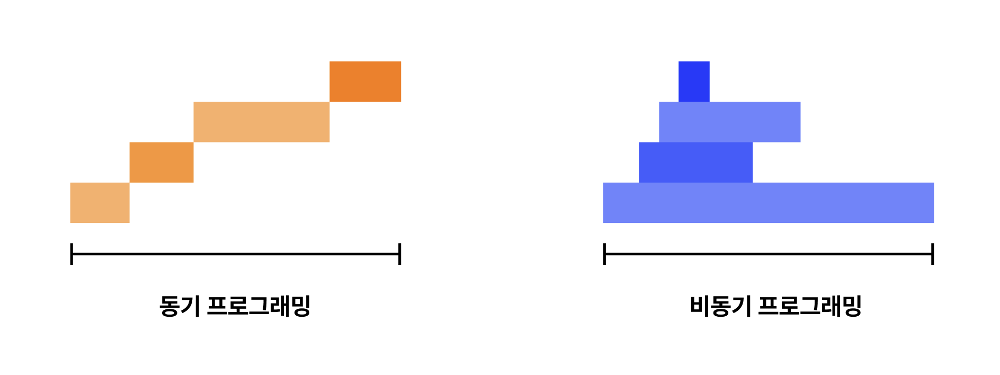

비동기 프로그래밍(Asynchronous Programming)은 프로그램의 실행 흐름이 특정 작업의 완료를 기다리지 않고, 이는 특히 네트워크 요청, 파일 입출력, 타이머 등 시간이 오래 걸리는 작업에서 유용합니다.

### 콜백 함수

콜백 함수(Callback Function)는 다른 함수에 인자로 전달되어, 특정 작업이 완료된 후 호출되는 함수입니다. 오래 걸리는 작업에서, 이후에 실행할 코드를 콜백 함수로 전달하여 작업이 끝난 후 무엇을 해야 할 지 알려주는 것입니다.

```javascript
function fetchData(callback) {
  setTimeout(() => {
    const data = { name: "John Doe" };
    callback(data);
  }, 1000);
}

fetchData((data) => {
  console.log(data); // { name: 'John Doe' }
});
```

#### 콜백 지옥(Callback Hell)

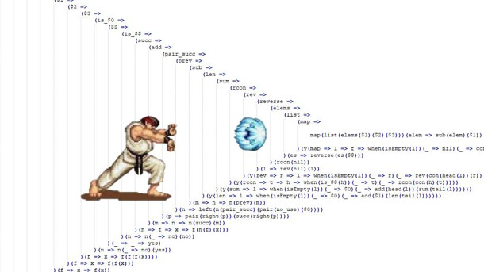

> Source: [flickr](https://www.flickr.com/photos/deathhell/53687889607)

콜백 함수는 함수를 인자로 전달하는 방식이기 때문에, Prop drilling과 유사한 콜백 지옥(Callback Hell) 문제를 일으킬 수 있습니다. 가령 여러 비동기 작업을 순차적으로 실행한다고 할 때,

```javascript
fetchData((data1) => {
  fetchMoreData(data1, (data2) => {
    fetchEvenMoreData(data2, (data3) => {
      console.log(data3);
    });
  });
});
```

이런 식으로 콜백의 중첩이 깊어지면 코드의 가독성이 떨어지고 유지보수가 어려워집니다. 이를 해결하기 위해 Promise가 도입되었습니다.

### Promise

Promise는 JavaScript에서 비동기 작업을 처리하기 위하여 사용하는 특수한 자료형입니다.
함수에서 Promise를 반환하면 호출부에서 코드를 계속 진행하면서 `.then()` 메서드를 사용하여
완료 후 실행할 코드를 등록하여 동시에 여러 작업을 처리할 수 있습니다.

Promise는 세 가지 상태를 가집니다: 대기(pending), 이행(fulfilled), 거부(rejected).
초기 상태는 대기이며, Promise를 생성할 때 전달된 `resolve` 함수가 호출되면 이행 상태로,
`reject` 함수가 호출되면 거부 상태로 전환됩니다.

```javascript
function fetchData() {
  return new Promise((resolve, reject) => {
    setTimeout(() => {
      const data = { name: "John Doe" };
      resolve(data);
    }, 1000);
  });
}

fetchData()
  .then((data) => {
    console.log(data); // { name: 'John Doe' }
  })
  .catch((error) => {
    console.error(error);
  });
```

Promise는 `.then()` 메서드를 사용하여 이행 상태일 때 실행할 콜백 함수를 등록하고,
`.catch()` 메서드를 사용하여 거부 상태일 때 실행할 콜백 함수를 등록합니다.

### async/await

Promise는 콜백 지옥 문제를 어느 정도 해결하지만,
여러 작업을 순차적으로 실행해야 할 때 `.then()`을 체이닝해서 사용해야 하는 문제가 여전히 남아 있습니다.

```javascript
fetchData()
  .then((data1) => {
    return fetchMoreData(data1);
  })
  .then((data2) => {
    return fetchEvenMoreData(data2);
  })
  .then((data3) => {
    console.log(data3);
  })
  .catch((error) => {
    console.error(error);
  });
```

이를 해결하고, 훨씬 직관적인 비동기 코드 작성을 가능하게 하는 것이 `async/await`입니다.
Promise 기반의 비동기 코드를 마치 동기 코드처럼 작성할 수 있도록 하는 특수 문법입니다.

`async` 키워드는 함수를 비동기 함수로 만들고, `await` 키워드는 Promise가 해결될 때까지 기다립니다.

```javascript
function fetchData() {
  return new Promise((resolve, reject) => {
    setTimeout(() => {
      const data = { name: "John Doe" };
      resolve(data);
    }, 1000);
  });
}

async function main() {
  try {
    const data = await fetchData();
    console.log(data); // { name: 'John Doe' }
  } catch (error) {
    console.error(error);
  }
}
```

```javascript
async function getUser() {
  const response = await fetch("https://api.example.com/user");
  const user = await response.json();
  return user;
}

async function main() {
  try {
    const user = await getUser();
    console.log(user);
  } catch (error) {
    console.error(error);
  }
}
```

### 왜 굳이 비동기 프로그래밍을 사용할까?

자바스크립트는 싱글 스레드(Single Thread) 언어로, 한 번에 하나의 작업만 처리할 수 있습니다. 만약 시간이 오래 걸리는 작업(예: 네트워크 요청, 파일 읽기 등)을 동기적으로 처리한다면, 그 동안 **다른 작업이 모두 멈추게 되어** 사용자 경험이 매우 나빠집니다.

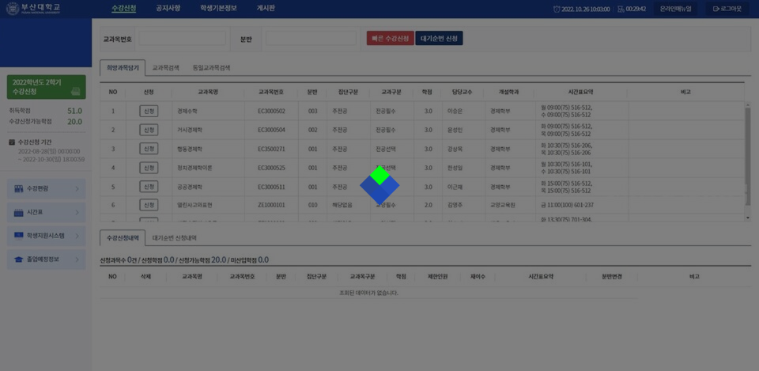

> 매우 나쁜 예시: 부산대학교 수강신청 시스템 (ㅠㅠ)

## 브라우저가 Google에 접속하는 과정

> 웹 브라우저가 `https://www.google.com`에 접속하는 과정을 단계별로 설명해 주세요.

이 질문은 우리 동아리의 면접 질문으로도 사용되었던 질문이지만,
정확하게 답변할 수 있는 사람은 많지 않습니다. 지금부터 그 과정을 단계적으로 살펴보겠습니다.

### DNS 조회

URL의 구조는 다음과 같습니다.

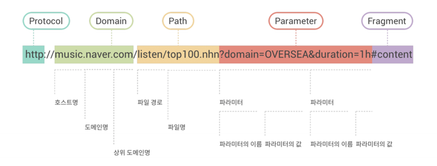

- 프로토콜: 통신 규약 (예: HTTP, HTTPS)
- 도메인: 서버의 주소 (예: www.google.com)
- 경로: 서버 내의 특정 자원 위치 (예: /search)
- 쿼리 문자열: 추가 매개변수 (예: ?q=javascript)
- 프래그먼트: 문서 내 특정 위치 (예: #section1)

이 중 '도메인'은 본래 **서버의 IP 주소**가 위치할 자리입니다. 하지만 사람이 IP 주소를 외워서
사이트에 접속하기는 어렵기 때문에, 사람이 이해할 수 있는 언어인 **도메인**을 IP 주소로
매핑해 주는 시스템이 필요합니다. 이것이 바로 **DNS(Domain Name System)** 입니다.

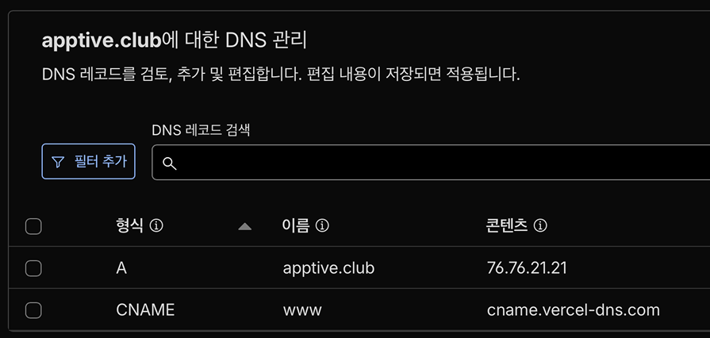

DNS는 도메인 이름을 IP 주소로 매핑하는 거대한 테이블이라고 생각하시면 편합니다. DNS를 통하여 확보한 IP 주소를 가지고, 해당 서버에 요청을 보냅니다.

### HTTP

HTTP(HyperText Transfer Protocol)는 웹에서 클라이언트(브라우저)와 서버 간에 데이터를 주고받기 위한 프로토콜입니다. HTTP 요청은 다음과 같은 구성 요소로 이루어져 있습니다.

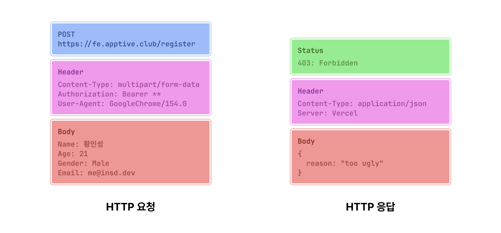

#### HTTP 요청 구성 요소

- Method: 요청의 종류를 나타냅니다. 일반적으로 GET, POST, PUT, DELETE 등이 있습니다.
- URL: 요청하는 자원의 위치를 나타냅니다.
- Headers: 요청에 대한 추가 정보를 담고 있습니다. 예를 들어, 클라이언트 정보 (User-Agent), 인증 정보(Authorization) 등이 있습니다.
- Body: POST, PUT 요청에서 서버로 전송하는 데이터가 포함됩니다. (아이디, 비밀번호 등)

#### HTTP 응답 구성 요소

- Status Code: 요청에 대한 서버의 응답 상태를 나타냅니다. 예를 들어, 200(성공), 404(찾을 수 없음), 500(서버 오류) 등이 있습니다.
- Headers: 응답에 대한 추가 정보를 담고 있습니다. 예를 들어, 콘텐츠 유형(Content-Type), 캐시 제어(Cache-Control) 등이 있습니다.
- Body: 서버가 클라이언트에 전송하는 실제 데이터가 포함됩니다. 예를 들어, HTML 문서, 이미지, JSON 데이터 등이 있습니다.

> #### 브라우저 주소창에는 URL만 입력하지 않나요?
>
> 일반적으로 주소창에 `example.com`과 같이 도메인만 입력하는 경우가 많습니다. 이 경우 브라우저는
> 기본적으로 HTTP 프로토콜을 사용하며, GET 메서드를 사용하여 오청을 보냅니다.
> HTTPS를 사용하는 웹 서버들은 대부분 HTTP 요청을 HTTPS로 리다이렉트(자동 전환) 해 주기 때문에,
> 사용자는 HTTPS로 접속하는지 여부를 신경쓰지 않아도 됩니다.

> #### HTTPS
>
> HTTPS(HyperText Transfer Protocol Secure)는 HTTP에 SSL 인증서를 적용하여, 데이터를
> 암호화하여 전송합니다. 이를 통해 중간자 공격을 방지하고, 데이터의 무결성과 기밀성을 보장합니다.

> #### HTTP의 포트 번호
>
> 일반적으로 HTTP는 80번 포트를, HTTPS는 443번 포트를 사용합니다.
> IP 또는 도메인 뒤에 포트 번호가 명시되지 않은 경우, 브라우저는 HTTP의 경우 80번, HTTPS의 경우 443번 포트를 자동으로 사용합니다.
> `example.com:8080`과 같이 포트 번호가 명시된 경우에는 해당 포트를 사용합니다.

### HTML

웹 서버에 GET 요청을 보내면, 서버는 HTML 문서를 응답으로 반환합니다. 이 HTML 문서는 웹 페이지의 구조와 내용을 정의하는 마크업 언어입니다. 이 말은, 단순히 텍스트와 이미지, 링크 등을 배치하는 역할 뿐만 아니라 다음 정보를 포함합니다.

- 메타데이터: 카카오톡에 링크를 공유했을 때 미리보기로 표시되는 제목, 설명, 이미지 등
- 스크립트: 자바스크립트 코드 또는 외부 자바스크립트 파일에 대한 링크
- 스타일시트: CSS 코드 또는 외부 CSS 파일에 대한 링크
- 접근성 정보: 스크린 리더가 읽을 수 있도록 돕는 ARIA 속성 등

브라우저는 서버로부터 받은 HTML 문서를 파싱하여 DOM(Document Object Model)을 생성합니다. DOM은 HTML 문서의 구조를 트리 형태로 표현한 것으로, 자바스크립트가 HTML 요소에 접근하고 조작할 수 있도록 합니다.

HTML 문서를 로드한 웹 브라우저는 `<link>`, `<script>`, `` 태그 등을 통해 추가 리소스(CSS, 자바스크립트 파일, 이미지 등)를 서버에 요청하고, 이를 다운로드하여 웹 페이지를 완성합니다.

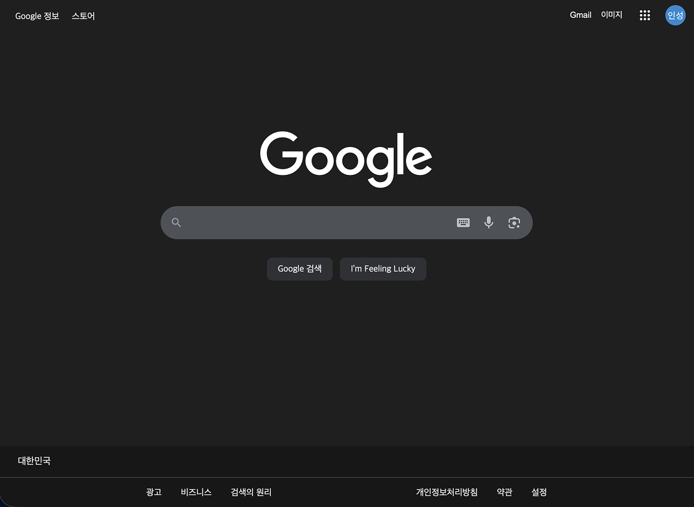

이렇게 해서, 브라우저는 최종적으로 사용자에게 시각적으로 표현되는 웹 페이지를 렌더링합니다.

## Single Page App 이해하기

### 웹 서버

웹 서버는 클라이언트가 요청한 HTML, CSS, JavaScript 파일 및 이미지와 같은
자원을 HTTP 프로토콜을 통해 제공하는 응용 프로그램입니다. 웹 서버를 이해하려면,
먼저 웹 서버가 어떻게 발전해 왔는지 살펴보는 것이 도움이 됩니다.

### 정적 웹 서버

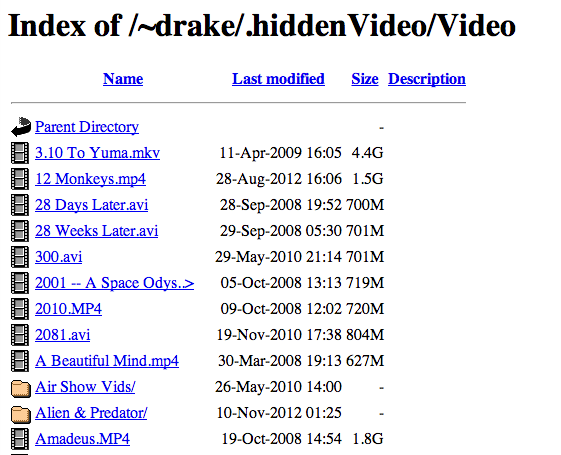

가장 초기 형태인 정적 웹 서버(Static Web Server)는 파일 시스템에 저장된 정적 파일(HTML, CSS, JavaScript, 이미지 등)을 클라이언트에 그대로 제공하는 역할을 하였습니다.

따라서 파일을 저장하는 디렉터리 구조가 곧 URL 구조와 일치하게 됩니다. 예를 들어, `index.html` 파일이 루트 디렉터리에 위치하면, 클라이언트는 `http://example.com/index.html`로 접근할 수 있습니다.

이 시기의 웹 어플리케이션은 개인 홈페이지, 기업 소개 페이지 등의 비교적 단순한 정보 제공에 주로 사용되었습니다.

### 동적 웹 서버

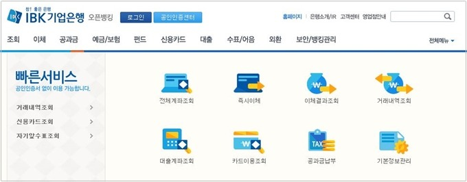

> 출처: IBK 기업은행

```php
<div>
  <?php
    $username = $_SESSION['username'];
    echo "<h1>Welcome, $username!</h1>";
  ?>
</div>
```

동적 웹 서버는 서버 측에서 코드를 실행하여 HTML을 생성하고, 이를 클라이언트에 제공하는 역할을 합니다. PHP, JSP, ASP 등이 대표적인 동적 웹 서버 기술입니다.

동적 HTML 생성이 도입되면서 로그인 상태, 시간 등 다양한 조건에 따라 사용자 맞춤형 콘텐츠를 제공할 수 있게 되었으며, 이는 웹 어플리케이션이라는 새로운 패러다임을 탄생시켰습니다.

### Web Application

동적 웹 서버를 통해 구현하는 웹 어플리케이션(Web Application)은 HTTP 프로토콜을 통해
웹 서버에서 원격으로 구동하는 사용자 어플리케이션입니다. 사용자는 웹 브라우저를 통해
웹 어플리케이션에 접속하여, 마치 데스크톱 어플리케이션처럼 다양한 기능을 사용할 수 있습니다.

웹 어플리케이션의 예시로는 이메일 서비스(Gmail), 소셜 미디어(Facebook), 온라인 쇼핑몰(Amazon) 등이 있습니다. 이러한 서비스들의 등장으로 웹 생태계는 단순한 정보 제공을 넘어, 복잡한 상호작용이 가능한 플랫폼으로 진화하게 되었습니다.

### AJAX

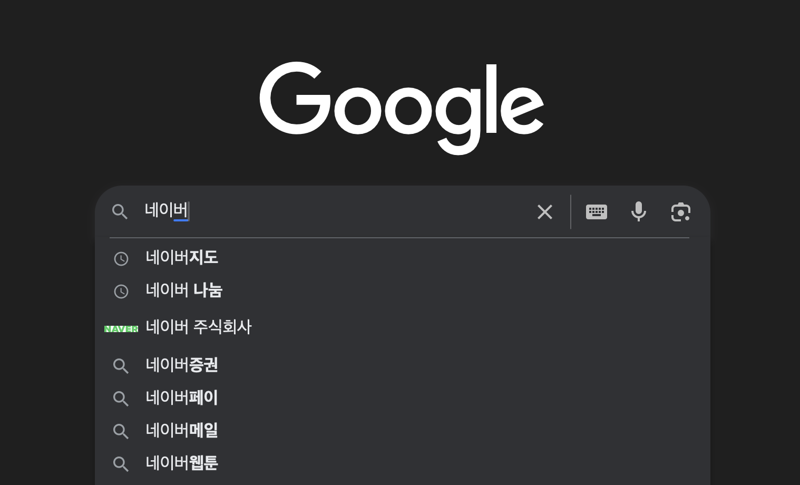

> Google의 검색어 자동 완성 기능

동적 웹 어플리케이션이 발전하면서, 페이지 전체를 새로고침하지 않고도 서버와 비동기적으로 통신하여 필요한 데이터만 갱신하는 기술이 필요해졌습니다. 이를 가능하게 한 것이 AJAX(Asynchronous JavaScript and XML)입니다.

AJAX는 자바스크립트를 사용하여 백그라운드에서 서버와 통신하고, 필요한 데이터를 받아와서 웹 페이지의 일부를 동적으로 업데이트할 수 있게 합니다. 이를 통해 웹 페이지를 후가공하고, 고급 어플리케이션 기능을
구현할 수 있게 되었습니다.

### DOM

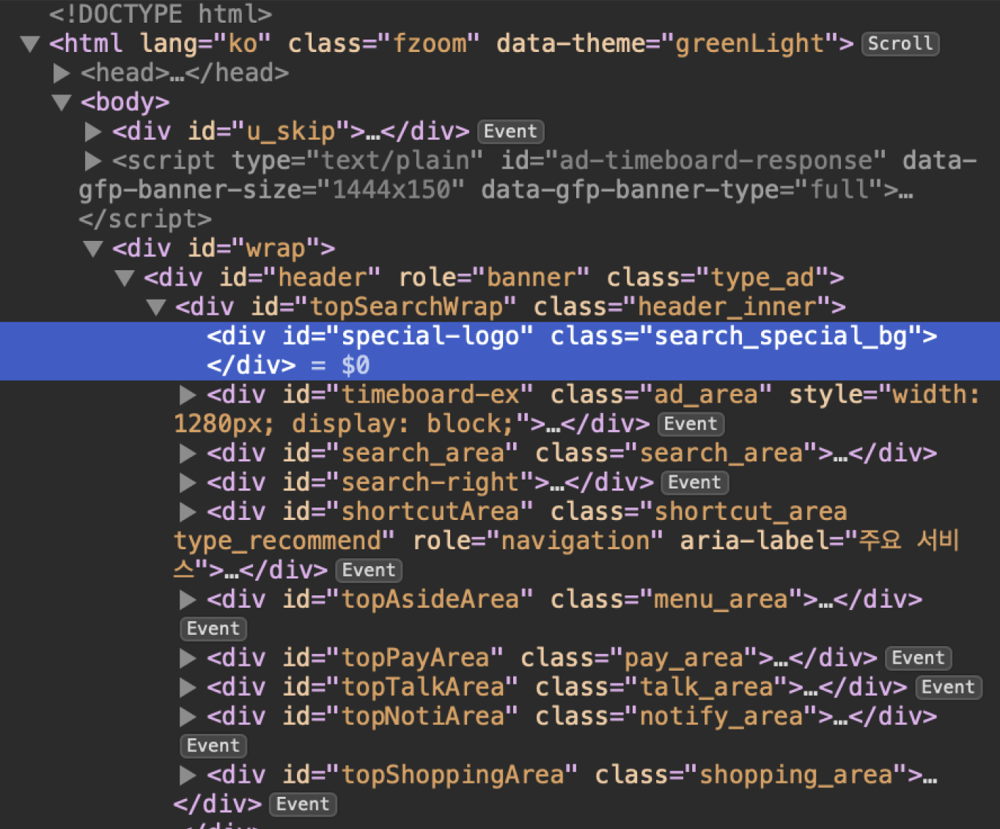

> Web Inspector로 확인한 naver.com DOM 구조

DOM(Document Object Model)은 HTML, XML을 동적으로 조작할 수 있도록 구조화한 인터페이스입니다. DOM은 문서의 구조를 트리 형태로 표현하며, 각 노드는 문서의 요소, 속성, 텍스트 등을 나타냅니다.

JavaScript와 같은 프로그래밍 언어를 사용하여 이를 조작할 수 있으며, 이렇게 조작한 웹 페이지는
즉시 사용자에게 반영됩니다. Web Inspector와 같은 개발자 도구를 사용하면, 브라우저가 렌더링한 DOM 구조를 시각적으로 확인할 수 있습니다.

### Single Page Application (SPA)


스마트폰이 보급되고 Play Store, App Store와 같은 앱 마켓이 등장하면서 수많은 웹 서비스들이
모바일 앱 형태로 제공되기 시작했습니다. 모바일 앱의 코드는 사용자의 기기에 설치되기 때문에
서버와 불필요한 통신을 최소화하고, 빠른 반응성을 제공할 수 있었습니다.

이러한 모바일 어플리케이션의 발전은 웹 어플리케이션 개발에도 새로운 패러다임을 가져왔습니다.
그것이 바로 Single Page Application(SPA)입니다.

SPA는 단 하나의 HTML 문서와 JavaScript 코드로 구성된 웹 어플리케이션입니다.
보통 빈 HTML 문서와 JavaScript 번들 파일들로 구성되며, JavaScript가 DOM을 조작하여
필요한 화면을 동적으로 렌더링하며, 마치 Windows 프로그램을 실행하는 것과 같이 브라우저 위에서
응용 프로그램 코드를 구동합니다.

따라서 사용자가 페이지를 이동하여 전체 HTML 문서를
다시 불러오는 것이 아니라, 필요한 데이터만 AJAX의 형태로 서버에서 받아와서 화면을 갱신합니다.
이를 통해 모든 응용 프로그램 코드를 실행하던 서버의 부하를 줄여 더 쾌적한 사용자 경험을 제공합니다.

### SPA는 웹 서버를 통해 배포하는 어플리케이션

Vite를 사용하여 React 어플리케이션을 번들링하면, 정적 파일들(HTML, CSS, JavaScript 번들 파일 등)이 생성됩니다. 이러한 정적 파일들을 정적 웹 서버(예: Nginx, Apache, Vercel, Netlify 등)를 통해 배포함으로써 사용자들이 웹 브라우저를 통해 SPA에 접속할 수 있게 됩니다.


> Vite의 공식 홈페이지의 홍보 영상. 다양한 파일 (.tsx, .svelte 등)을 번들링하여
> html, css, js 파일로 변환하는 것을 표현하였다.

## Fetch API 사용해보기

### API 서버

서버 어플리케이션에서 수행해야 하는 기능 (로그인, 결제 등)을 클라이언트 어플리케이션에서에서 처리하기 위하여 필요한 기능만 규격화해둔 서버를 API 서버라고 합니다.

보통 `/api` 경로를 통해 접근할 수 있으며, REST API, GraphQL API 등이 대표적인 API 서버의 형태입니다. 우리 동아리에서는 REST API를 주로 사용합니다.

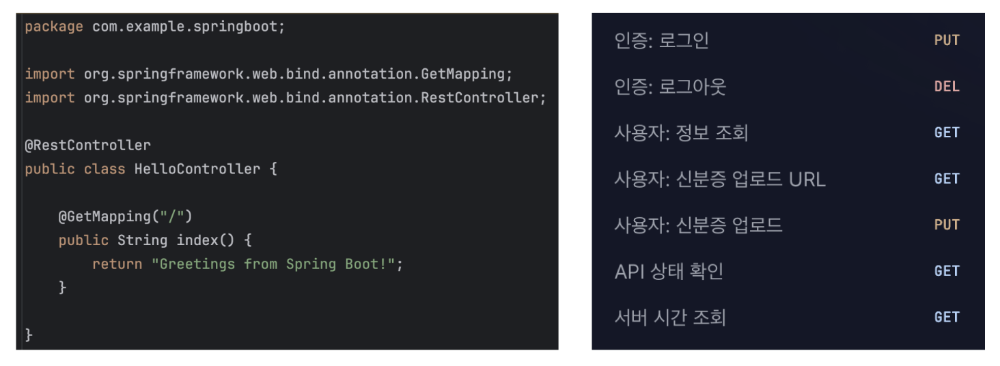

> Spring Boot로 구현한 API 서버

### API 명세 뜯어보기

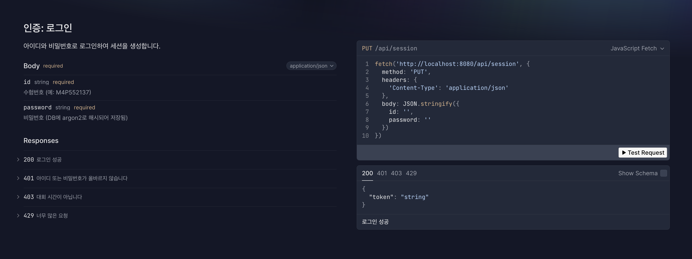

위는 Swagger UI로 본 API 명세의 예시입니다. 해당 명세에는 다음 내용이 포함되어 있습니다.

- 엔드포인트(Endpoint): API가 제공하는 기능에 접근하기 위한 URL 경로
- HTTP 메서드(Method): API 요청의 종류 (GET, POST, PUT, DELETE 등)
- 요청 Body(Request Body): 클라이언트가 서버로 전송하는 데이터 (예: JSON 형식)
- 응답 Body(Response Body): 서버가 클라이언트에 반환하는 데이터 (예: JSON 형식)
- 상태 코드(Status Code): 요청에 대한 서버의 응답 상태 (200, 404, 500 등)

해당 명세에 맞게 API 요청을 보내면, 서버는 정의된 형식에 따라 응답을 반환합니다.
여러분이 백엔드 개발자와 함께 협업을 진행하면 이러한 명세를 보면서 연동 작업을 수행하게 될 것입니다.

> #### API (Application Programming Interface)
>
> 응용 프로그램과 응용 프로그램 사이의 연결, 연동을 위한 규격을 뜻합니다.
> Fetch API에서의 **API**는 **내 JavaScript 어플리케이션**과 **브라우저** 간의 연동을 뜻하는 것이고,
> API 서버에서의 **API**는 **내 JavaScript 어플리케이션**과 **백엔드 서버** 간의 연동을 뜻하는 것입니다.

> #### JSON (JavaScript Object Notation)
>
> JavaScript의 Object 자료형을 본뜬 텍스트 문서이자 경량 데이터 교환 형식입니다.
> CSV, XML 등 다른 데이터 교환 형식에 비해 가독성이 뛰어나고 파싱이 용이하여
> 현대 웹 개발에서 널리 사용되고 있습니다.

### Fetch API

```javascript
async function getUser() {
  const response = await fetch("https://api.example.com/user");
  const user = await response.json();
  return user;
}
```

Fetch API는 브라우저 환경에서 API 서버와 비동기 통신을 위한 현대적인 표준 규격입니다.
`fetch` 함수를 사용하여 네트워크 요청을 보내고, Promise를 반환합니다. 이를 통해 비동기적으로 데이터를 가져오거나 서버에 데이터를 전송할 수 있습니다. 간결하고 높은 사용성을 제공합니다.

#### React에서 Fetch API 사용하기

```javascript
import { useEffect, useState } from "react";

function UserProfile() {
  const [profile, setProfile] = useState(null);

  // 웹 서버에서 데이터를 로드하는 것은 Side Effect에 해당합니다.
  // 따라서 useEffect 훅을 사용하여 데이터를 State에 로드합니다.
  useEffect(() => {
    async function fetchProfile() {
      const response = await fetch("/api/user/profile");
      const data = await response.json();
      setProfile(data);
    }

    fetchProfile();
  }, []);

  // 프로필 데이터가 아직 로드되지 않은 경우 로딩 메시지를 표시합니다.
  if (!profile) {
    return <div>로드 중...</div>;
  }

  return (
    <div>
      <h1>{profile.name}님의 프로필</h1>
      <p>이메일: {profile.email}</p>
    </div>
  );
}
```

- 서버에서 데이터를 로드하는 작업은 Side Effect에 해당하므로, `useEffect` 훅을 사용하여 컴포넌트가 마운트될 때 데이터를 불러옵니다.
- 첫 렌더링이 완료된 후 `useEffect` 훅이 실행되므로, 초기 상태에서는 `profile`이 `null`입니다. 따라서 데이터를 불러오는 동안 로딩 메시지를 표시합니다.
- 데이터가 로드되면 `setProfile` 함수를 사용하여 상태를 업데이트하고, 컴포넌트가 다시 렌더링되어 프로필 정보를 표시합니다.

### 실습: 나의 공인 IP 주소 확인하기

```text
GET https://api.ipify.org?format=json
```

위 주소에 API 요청을 전송하고, 응답으로 받은 JSON 데이터를 React 컴포넌트에서 표시해 봅시다.

## 번외

### 내 어플리케이션을 어떻게 배포할까?

여러분의 React App을 Vite로 번들링하면 html, css, js 파일들이 생성된다는 것을 알고 계실 것입니다. 이 파일들을 어떻게 배포하여야 할까요?

APPTIVE에서 프로젝트를 진행하게 된다면 보통 Spring Boot 백엔드 개발자와 협업하여 배포를 진행하게
됩니다. 우리 동아리에서 만드는 서비스는 대부분 단기간에 구축하는 소규모의 프로젝트가 많으므로,
CDN 서버 등의 복잡한 인프라를 구축하지 않고 배포하는 경우가 많습니다.

따라서 배포 과정을 간소화하기 위하여 Spring Boot 어플리케이션 내에 정적 파일들을 포함시키는
방식을 사용하는 것이 좋습니다.

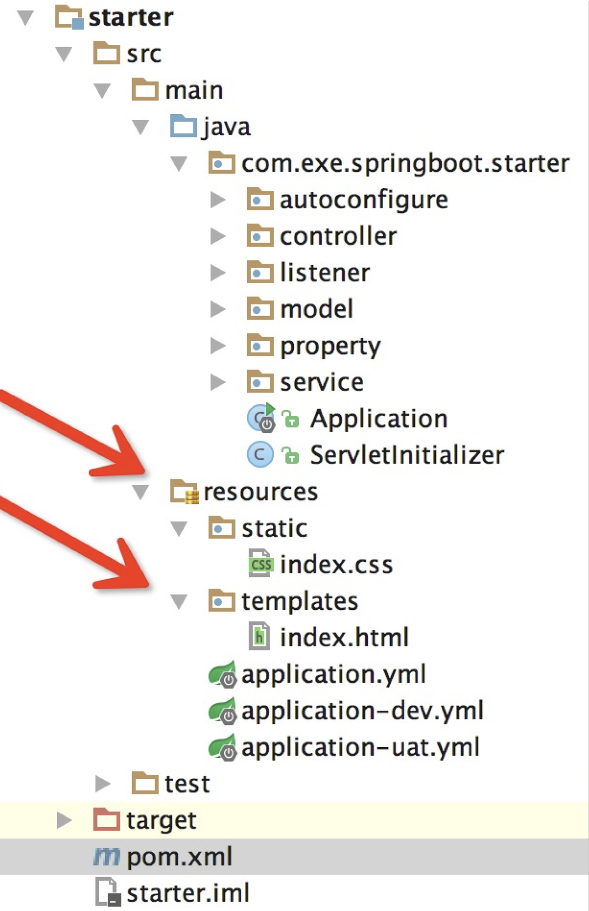

위 구조에서 `resources/static` 디렉터리에 Vite로 번들링한 정적 파일들을 복사해 넣으면,
Spring Boot가 동일 경로에 대한 정적 리소스 요청을 처리해 줍니다.

실제 업무에서는 Vite 번들러 설정에서 output 디렉터리를 Sprint Boot 리소스 디렉터리로 지정하거나,
Github Actions, Jenkins 등의 자동 배포 도구를 사용하여 이를 자동화하여 사용하는 경우가 많습니다.

이렇게 해서 Spring Boot 어플리케이션을 빌드하면, 정적 파일들이 포함된 하나의 JAR 파일이 생성됩니다. 이는 Java 런타임에게 `exe` 파일과 같은 역할을 합니다.

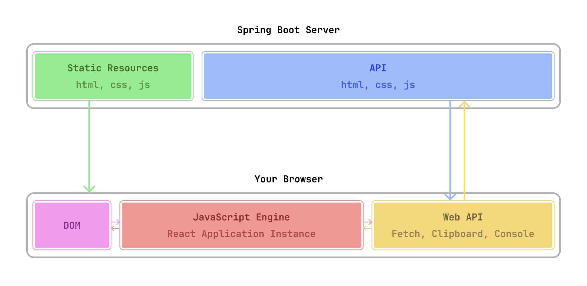

> Spring Boot로 SPA를 서빙하는 구조 예시

위는 이렇게 배포된 어플리케이션이 동작하는 방식을 나타낸 다이어그램입니다.

- `/api` 디렉터리를 제외한 경로에 요청을 보내면, 서버는 `index.html` 파일을 반환합니다.
- `index.html` 파일은 CSS, JavaScript 번들 파일들을 로드합니다.
- JavaScript 번들 파일이 실행되면서 React 어플리케이션이 구동됩니다.
- React 어플리케이션은 필요한 데이터를 동일한 API 서버에 요청하여 화면을 렌더링합니다.

> #### 제가 빌드한 어플리케이션을 Vercel에 배포하고 싶어요.
>
> 왠만하면 Spring Boot 백엔드 개발자와 협업하여 배포하는 방식을 추천드립니다.
> Vercel에 어플리케이션을 배포한다면, CORS 설정 등 복잡한 설정이 필요하고
> 백엔드 개발자와의 협업이 어려워질 수 있습니다.

> #### 프로젝트의 규모가 커졌을 때에도 이런 방식을 사용해야 할까요?
>
> 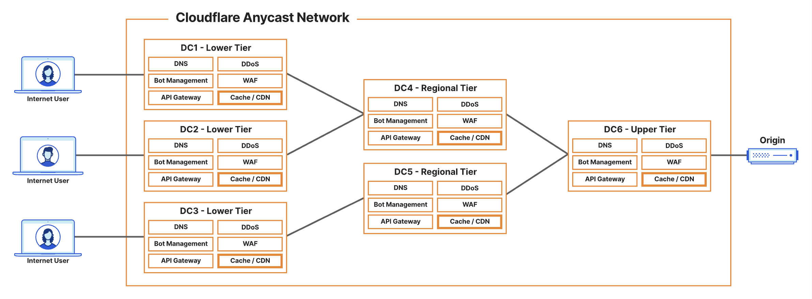
>
> 프로젝트의 규모가 커지고 트래픽이 많아지면, CDN 서버에 대한 필요가 생길 것입니다.
> 이 경우부터는 프론트엔드와 백엔드 어플리케이션을 분리하는 복잡한 아키텍처를 고려해야 할 것인데,
> 이 단계부터는 여러분이 CORS 설정 등 복잡한 설정을 다룰 수 있을 정도로 프로젝트에 익숙해졌을 것이라고 생각합니다.
> 중요한 것은 상황에 맞는 기술을 적절히 선택하는 능력입니다.

### SPA는 검색 엔진에 불리하다

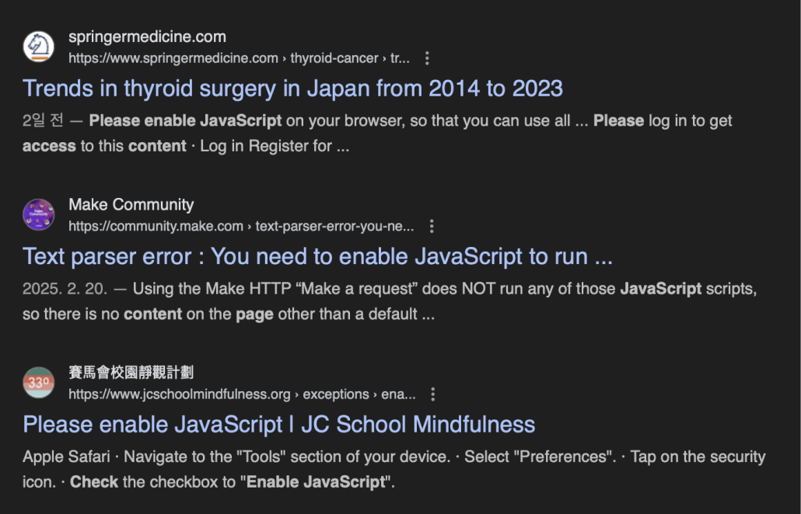

> 자바스크립트를 허용해 달라고 요청하는 사이트들

SPA는 기본적으로 빈 HTML 파일을 전달하고 내부를 JavaScript로 채우는 방식이기 때문에,
JavaScript를 실행하지 않는 검색 엔진 크롤러 (특히 네이버, 다음 등)에 취약해
검색 사이트에서 우리 서비스에 대한 정보를 제대로 수집하지 못할 수도 있습니다.

이를 해결하기 위하여 SSR(Server Side Rendering), SSG(Static Site Generation) 등의
기술이 존재하지만, 이는 우리 팀의 스터디 과정에서는 벗어난 이야기이므로,
이러한 기술이 필요해지만 각자 공부해 보시기 바랍니다.
