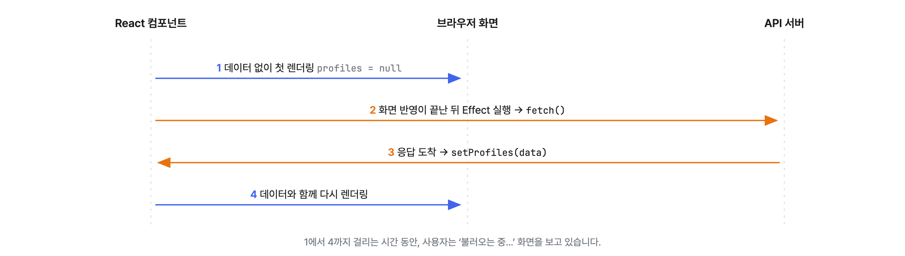
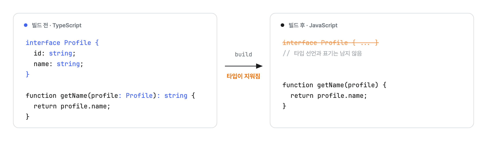
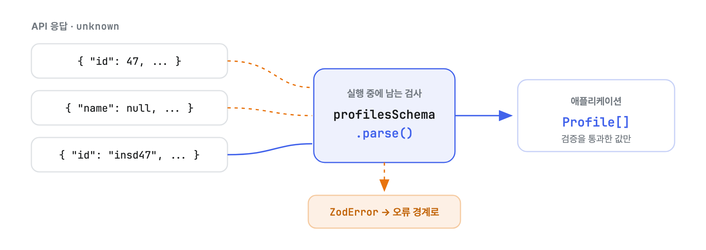
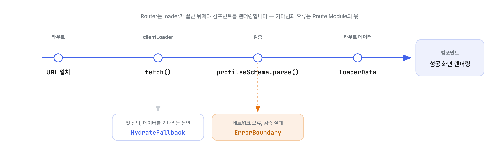
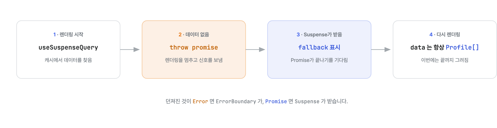
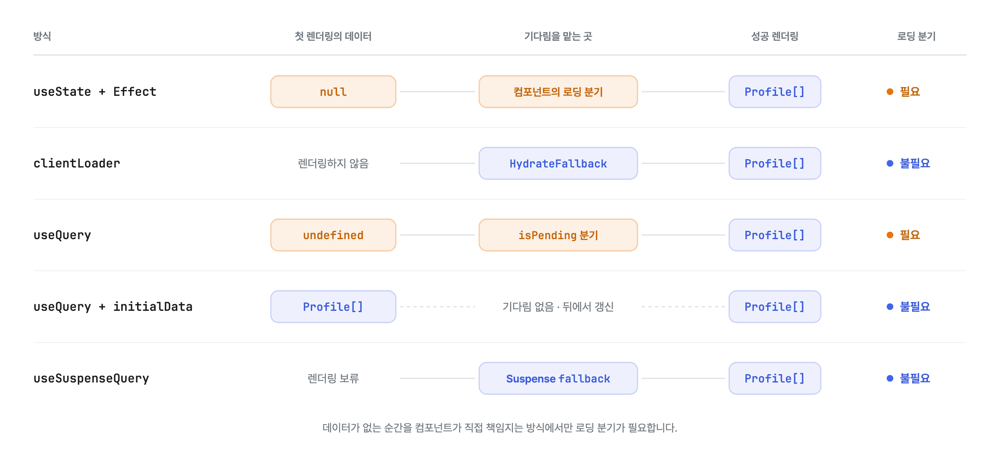
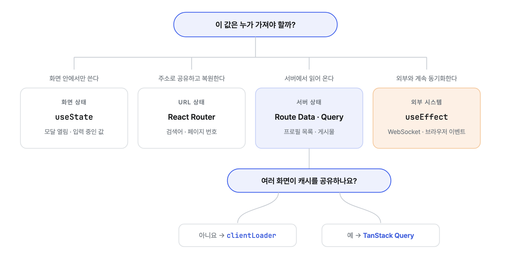

# API 요청과 React 상태 관리

지금까지 우리는 `useEffect` 안에서 `fetch()`를 호출하고, 응답을 `useState`에 담아 왔습니다. 화면이 한두 개일 때는 이것으로 충분하지만, 요청이 늘어날수록 로딩과 오류, 요청 취소, 캐시까지 컴포넌트가 전부 떠안게 됩니다.

이번 회차의 목표를 한 문장으로 줄이면 다음과 같습니다.

> 네트워크가 동기식으로 바뀌는 것이 아닙니다. **데이터를 기다리는 일을 컴포넌트 바깥으로 옮기는 것**입니다.

이 문장을 붙들고 다음 순서로 진행합니다.

1. 익숙한 `useEffect` 방식으로 실습 API를 요청하는 애플리케이션을 만듭니다.
2. TypeScript로 컴포넌트 구조를 만들고, 손으로 적은 데이터로 화면부터 확인합니다.
3. 타입이 실행 중에는 사라진다는 사실을 확인하고, Zod로 API 응답을 검증합니다.
4. React Router v7의 `clientLoader`와 TanStack Query를 단계적으로 도입해 코드를 개선합니다.

이 문서는 JavaScript와 Vite 기본 템플릿으로 React의 기본 훅을 써 본 사람을 기준으로 씁니다. TypeScript는 개발이 편해지는 만큼만 다루고, Router의 streaming이나 Query의 세부 캐시 옵션처럼 지금 필요하지 않은 내용은 다루지 않습니다.

## 0. 실습 API

이번 실습은 처음부터 끝까지 하나의 API로 진행합니다. 우리 동아리 멘토들의 프로필 목록입니다.

```text
GET https://insd.dev/api/apptive/profiles
```

```json
[
  {
    "id": "myeolinmalchi",
    "name": "강민석",
    "avatar": "https://github.com/myeolinmalchi.png",
    "githubUrl": "https://github.com/myeolinmalchi"
  },
  {
    "id": "insd47",
    "name": "황인성",
    "email": "me@insd.dev",
    "avatar": "https://github.com/insd47.png",
    "githubUrl": "https://github.com/insd47"
  }
]
```

한 가지 눈여겨볼 점이 있습니다. **`email`은 있는 사람도 있고 없는 사람도 있습니다.** 실제 API에는 이렇게 있을 수도 없을 수도 있는 값이 흔한데, 뒤에서 TypeScript의 선택 프로퍼티와 Zod의 `optional()`로 자연스럽게 표현하게 됩니다.

## 1. 익숙한 코드에서 시작하기

먼저 지금까지 써 온 방식 그대로 프로필 목록 화면을 만들어 봅시다.

```jsx
import { useEffect, useState } from 'react';

export default function ProfileList() {
  const [profiles, setProfiles] = useState(null);
  const [error, setError] = useState(null);

  useEffect(() => {
    fetch('https://insd.dev/api/apptive/profiles')
      .then((response) => {
        if (!response.ok) {
          throw new Error(`요청 실패: ${response.status}`);
        }

        return response.json();
      })
      .then(setProfiles)
      .catch(setError);
  }, []);

  if (error) return <p>불러오지 못했습니다.</p>;
  if (profiles === null) return <p>불러오는 중...</p>;

  return profiles.map((profile) => <article key={profile.id}>{profile.name}</article>);
}
```

Effect는 첫 렌더링이 화면에 반영된 뒤에 실행됩니다. 그러니 첫 렌더링 시점의 `profiles`는 언제나 `null`이고, 요청이 끝나 `setProfiles()`가 호출되어야 비로소 데이터가 있는 화면을 그릴 수 있습니다.

초기값으로 빈 배열 `[]`을 쓰지 않은 데에도 이유가 있습니다. 빈 배열로 시작하면 "아직 불러오지 않음"과 "멤버가 정말 0명임"을 구분할 수 없기 때문에, `null`을 로딩 전 상태로 정한 것입니다.



요청이 많아지면 컴포넌트가 직접 해결해야 하는 일도 함께 늘어납니다.

- 화면이 사라졌을 때 진행 중인 요청 취소하기
- 먼저 보낸 요청이 나중에 도착하는 경쟁 상태(Race Condition) 막기
- 같은 데이터를 다시 요청할지 판단하는 캐시 만들기
- 화면마다 로딩과 오류 UI 반복하기

`useEffect`가 잘못된 도구라는 뜻은 아닙니다. WebSocket, 브라우저 이벤트, 외부 위젯처럼 React 바깥의 시스템과 계속 동기화할 때는 여전히 Effect가 정답입니다. 이번 회차에서 옮기려는 것은 **서버 데이터 요청**이라는 한 가지 책임뿐입니다.

## 2. TypeScript: 컴포넌트에 타입 입히기

React Router의 Framework 프로젝트는 TypeScript를 기본으로 사용합니다. 프로젝트를 만들기 전에, 컴포넌트를 작성하는 데 필요한 만큼만 문법을 익혀 봅시다.

JSX가 들어가는 TypeScript 파일은 `.ts`가 아니라 `.tsx` 확장자를 사용합니다.

### 타입 표기와 유니온 타입

변수 이름 뒤에 `: 타입`을 적으면 그 자리에 올 수 있는 값이 제한됩니다.

```ts
const title: string = 'API 요청과 React 상태 관리';
const memberCount: number = 4;
const recruiting: boolean = true;
```

여러 타입 가운데 하나가 올 수 있다면 `|`로 잇습니다. 이런 타입을 유니온(Union) 타입이라고 부르며, 요청 전후의 State를 표현할 때 자주 씁니다.

```ts
let selectedProfileId: string | null = null;
```

이제 `selectedProfileId`에는 문자열 아니면 `null`만 담을 수 있습니다.

### `interface`로 Props 선언하기

객체가 어떤 프로퍼티를 어떤 타입으로 가지는지는 `interface`로 선언합니다. 0장에서 본 API 응답을 그대로 옮겨 봅시다.

```tsx
interface Profile {
  id: string;
  name: string;
  email?: string;
  avatar: string;
  githubUrl: string;
}

interface ProfileItemProps {
  profile: Profile;
  selected?: boolean;
  onSelect: (profileId: string) => void;
}

function ProfileItem({ profile, selected = false, onSelect }: ProfileItemProps) {
  return (
    <button aria-pressed={selected} onClick={() => onSelect(profile.id)}>
      
      {profile.name}
    </button>
  );
}
```

- `email?: string`의 `?`는 없을 수도 있다는 표시입니다. 실제 응답에서 `email`이 없는 사람이 있었던 것을 기억해 봅시다.
- `profile: Profile`은 반드시 전달해야 하는 prop이고, `selected?`는 생략할 수 있습니다.
- `(profileId: string) => void`는 문자열을 받고 아무것도 반환하지 않는 함수 타입입니다.

이제 `<ProfileItem />`을 사용할 때 `profile`이나 `onSelect`를 빠뜨리거나 엉뚱한 타입을 넘기면, 실행해 보기 전에 편집기가 오류를 알려 줍니다.

### `extends`로 이미 있는 Props 물려받기

`extends`를 쓰면 이미 있는 interface나 React가 제공하는 타입을 물려받으면서 필요한 prop만 덧붙일 수 있습니다.

#### `PropsWithChildren`

```tsx
import type { PropsWithChildren } from 'react';

interface PanelProps extends PropsWithChildren {
  title: string;
}

function Panel({ title, children }: PanelProps) {
  return (
    <section>
      <h2>{title}</h2>
      {children}
    </section>
  );
}
```

`PanelProps`는 직접 선언한 `title`에 더해 `children?: ReactNode`를 물려받습니다. 덕분에 문자열이든 JSX든, React가 렌더링할 수 있는 값이라면 무엇이든 자식으로 받을 수 있습니다.

#### `ComponentProps`

```tsx
import type { ComponentProps } from 'react';

interface AppButtonProps extends ComponentProps<'button'> {
  tone?: 'primary' | 'danger';
}

function AppButton({ tone = 'primary', ...buttonProps }: AppButtonProps) {
  return <button data-tone={tone} {...buttonProps} />;
}
```

`ComponentProps<'button'>`에는 `onClick`, `disabled`, `type`, `children`처럼 `<button>`이 원래 받을 수 있는 prop이 전부 들어 있습니다. `AppButtonProps`는 이를 그대로 물려받으면서 `tone` 하나만 더한 것입니다.

`tone?: 'primary' | 'danger'`처럼 문자열 값 자체를 타입으로 쓸 수도 있습니다. 두 문자열 말고 다른 값을 넘기면 오류가 됩니다.

`ComponentProps`는 직접 만든 컴포넌트에도 쓸 수 있습니다.

```ts
type ProfileItemPropsCopy = ComponentProps<typeof ProfileItem>;
```

### 타입 추론: 모든 곳에 타입을 적지 않아도 됩니다

TypeScript는 값과 코드의 흐름을 보고 스스로 타입을 알아냅니다.

```ts
const profiles: Profile[] = [
  {
    id: 'myeolinmalchi',
    name: '강민석',
    avatar: 'https://github.com/myeolinmalchi.png',
    githubUrl: 'https://github.com/myeolinmalchi',
  },
  {
    id: 'insd47',
    name: '황인성',
    email: 'me@insd.dev',
    avatar: 'https://github.com/insd47.png',
    githubUrl: 'https://github.com/insd47',
  },
];

const names = profiles.map((profile) => profile.name);
// profile은 Profile로, names는 string[]으로 추론됩니다.

function getName(profile: Profile) {
  return profile.name;
}
// 반환 타입은 string으로 추론됩니다.
```

함수의 매개변수나 컴포넌트의 Props처럼 **데이터가 들어오는 입구**에는 타입을 적고, 함수 안에서 만들어지는 값은 추론에 맡기는 편이 읽기 좋습니다.

초기값만으로 타입을 다 알 수 없을 때는 훅의 꺾쇠 안에 타입을 알려 줍니다.

```tsx
const [profiles, setProfiles] = useState<Profile[] | null>(null);
```

이렇게 하면 `profiles`가 `null`일 가능성을 처리하지 않은 채 `profiles.map()`을 호출했을 때 TypeScript가 오류를 표시해 줍니다.

### 손으로 적은 데이터로 테스트 렌더링

API를 붙이기 전에, 방금 만든 컴포넌트가 잘 동작하는지 위의 `profiles` 배열로 먼저 확인해 봅시다.

```tsx
function ProfileList() {
  const [selectedProfileId, setSelectedProfileId] = useState<string | null>(null);

  return (
    <ul>
      {profiles.map((profile) => (
        <li key={profile.id}>
          <ProfileItem
            profile={profile}
            selected={profile.id === selectedProfileId}
            onSelect={setSelectedProfileId}
          />
        </li>
      ))}
    </ul>
  );
}
```

데이터가 이미 준비되어 있으니 로딩 분기가 하나도 없다는 점을 봐 두면 좋습니다. 이번 회차의 나머지는 **API에서 받아 온 데이터로도 화면을 이렇게 쓰기 위한 여정**입니다.

### 제네릭 맛보기

방금 쓴 `useState<...>`의 꺾쇠가 바로 제네릭(Generic)입니다. 함수나 타입이 다룰 타입을 미리 정해 두지 않고, 사용하는 쪽에서 결정하게 하는 문법입니다.

```ts
function getFirst<T>(items: T[]): T | undefined {
  return items[0];
}

const firstProfile = getFirst(profiles);
// Profile | undefined로 추론

const firstTitle = getFirst(['TypeScript', 'React Router']);
// string | undefined로 추론
```

호출할 때 `<Profile>`을 직접 적지 않아도, 인자로 넘어온 배열을 보고 `T`가 무엇인지 추론됩니다. 앞에서 본 `PropsWithChildren`과 `ComponentProps<'button'>`도 모두 제네릭입니다.

### 타입은 빌드하면 사라진다

이번 회차에서 가장 중요한 사실 하나를 확인하고 넘어가겠습니다. 다음 TypeScript 코드를 빌드하면,

```ts
interface Profile {
  id: string;
  name: string;
}

function getName(profile: Profile): string {
  return profile.name;
}
```

브라우저가 실제로 실행하는 JavaScript에는 이것만 남습니다.

```js
function getName(profile) {
  return profile.name;
}
```

`interface Profile`도, `: Profile`과 `: string` 표기도 흔적 없이 사라졌습니다. 타입은 편집기와 컴파일러가 코드를 검사할 때 쓰는 설계도일 뿐, 브라우저에게는 전달되지 않습니다.



그래서 타입을 실행 중의 검사에 쓸 수 없습니다.

```ts
if (data instanceof Profile) {
  // 오류: 'Profile'은(는) 형식만 참조하지만, 여기서는 값으로 사용되고 있습니다.
}
```

더 중요한 것은, **타입을 적어 두었다고 해서 값이 검사되지는 않는다**는 점입니다.

```ts
const data = JSON.parse('{ "id": 47, "name": null }') as Profile;

data.name.toUpperCase();
// 편집기도 컴파일러도 아무 말이 없습니다.
// 실행하면 → TypeError: Cannot read properties of null (reading 'toUpperCase')
```

`as Profile`은 "이 값을 `Profile`로 믿어 달라"는 선언일 뿐, 검사가 아닙니다. TypeScript는 우리가 적은 타입을 그대로 믿고, 실행될 때에는 그 믿음을 확인할 코드 자체가 남아 있지 않습니다.

프로젝트 안에서 우리가 만드는 값은 컴파일러가 끝까지 지켜보고 있으니 괜찮습니다. 문제는 **API 응답처럼 바깥에서 들어오는 값**입니다. 서버가 명세와 다른 값을 보내도 TypeScript는 알 길이 없으므로, 실행 중에 직접 검사해야 합니다. `typeof`로 프로퍼티를 하나하나 확인하는 코드를 손으로 쓸 수도 있지만, 그러면 타입 선언과 검사 코드를 이중으로 관리하게 됩니다. 이 일을 대신해 주는 도구가 Zod입니다.

## 3. Zod: 바깥에서 온 값을 실행 중에 검증하기

TypeScript 타입은 빌드하면 사라지지만, Zod 스키마는 실제 JavaScript 값이므로 실행 중에도 남아 있습니다. 그래서 API 응답, URL 파라미터, `localStorage`처럼 애플리케이션 바깥에서 들어오는 값을 검사할 수 있습니다.

```bash
pnpm add zod
```

### 스키마 하나로 검증과 타입을 함께

```ts
// app/api/profile-schema.ts
import { z } from 'zod';

export const profileSchema = z.object({
  id: z.string(),
  name: z.string().min(1),
  email: z.email().optional(),
  avatar: z.url(),
  githubUrl: z.url(),
});

export const profilesSchema = z.array(profileSchema);

export type Profile = z.infer<typeof profileSchema>;
```

`profilesSchema`는 실행 중의 검증을 맡고, `z.infer`는 같은 스키마에서 TypeScript 타입을 뽑아냅니다. 값의 생김새를 한 곳에만 적어 두면 검증 코드와 타입이 어긋날 일이 없습니다.

스키마가 타입보다 표현력이 좋다는 점도 봐 둘 만합니다. `email?: string`은 "문자열이거나 없음"까지만 말하지만, `z.email().optional()`은 **이메일 형식이 맞는지**까지 검사합니다. `z.url()`도 마찬가지입니다.



### 검사는 경계에서 한 번만

```ts
// app/api/profiles.ts
import { profilesSchema } from './profile-schema';

const PROFILES_URL = 'https://insd.dev/api/apptive/profiles';

export async function getProfiles(signal?: AbortSignal) {
  const response = await fetch(PROFILES_URL, { signal });

  if (!response.ok) {
    throw new Error(`프로필 요청 실패: ${response.status}`);
  }

  const data: unknown = await response.json();
  return profilesSchema.parse(data);
}
```

응답을 일단 `unknown`으로 받고, `parse()`를 통과한 값만 반환합니다. 검사에 실패하면 `parse()`가 오류를 던지므로, `getProfiles()` 바깥의 세계에는 검증된 `Profile[]`만 존재합니다. 화면마다 같은 검사를 반복할 필요가 없습니다.

## 4. React Router v7: 화면을 그리기 전에 데이터 준비하기

이번 회차의 기본 구현입니다. React Router의 Framework Mode에서 Route Module은 URL, 데이터 로딩, 오류 처리를 한곳에 모읍니다.

핵심 규칙은 하나입니다. Router는 `clientLoader`가 끝나기를 기다렸다가 라우트 컴포넌트를 렌더링합니다. 그러니 컴포넌트 입장에서는 **데이터가 이미 준비되어 있고**, `isLoading` State나 로딩 조건문을 만들 이유가 없습니다.



### 1단계: Framework 프로젝트 만들기

```bash
pnpm dlx create-react-router@latest router-demo
cd router-demo
pnpm add zod
pnpm dev
```

TypeScript 설정과 Route Module 구조가 갖춰진 채로 생성됩니다. 기존 Vite 프로젝트에 Router를 하나씩 붙이는 대신, 준비된 구조를 그대로 사용합니다.

### 2단계: SPA Mode 켜기

```ts
// react-router.config.ts
import type { Config } from '@react-router/dev/config';

export default {
  ssr: false,
} satisfies Config;
```

`ssr: false`는 서버 렌더링을 끄고 우리가 알고 있는 SPA로 동작하게 합니다. SSR과 사전 렌더링은 이번 회차의 범위 밖입니다.

### 3단계: 목록 라우트 연결하기

```ts
// app/routes.ts
import { index, type RouteConfig } from '@react-router/dev/routes';

export default [index('routes/profiles.tsx')] satisfies RouteConfig;
```

### 4단계: `clientLoader`로 요청 옮기기

```tsx
// app/routes/profiles.tsx
import type { Route } from './+types/profiles';
import { getProfiles } from '../api/profiles';

export async function clientLoader({ request }: Route.ClientLoaderArgs) {
  return {
    profiles: await getProfiles(request.signal),
  };
}

export function HydrateFallback() {
  return <p>프로필을 불러오는 중입니다.</p>;
}

export default function Profiles({ loaderData }: Route.ComponentProps) {
  return (
    <main>
      <h1>APPTIVE 멤버</h1>
      <ul>
        {loaderData.profiles.map((profile) => (
          <li key={profile.id}>
            
            <a href={profile.githubUrl}>{profile.name}</a>
          </li>
        ))}
      </ul>
    </main>
  );
}
```

흐름은 세 단계입니다.

1. `clientLoader`가 브라우저에서 요청을 시작합니다.
2. 첫 진입에서 데이터가 아직 없다면 `HydrateFallback`이 보입니다.
3. 요청이 끝나면 `loaderData.profiles`가 채워진 채로 컴포넌트가 렌더링됩니다.

`loaderData.profiles`의 타입은 `clientLoader`의 반환 타입에서 자동으로 추론된 `Profile[]`입니다. `null`도 `undefined`도 아니므로, 1장에서 썼던 이 조건문이 통째로 사라집니다.

```tsx
if (profiles === null) return <p>불러오는 중...</p>;
```

기다리는 화면은 컴포넌트 안이 아니라 Route Module의 `HydrateFallback`이 맡습니다. 이것이 `useEffect` 방식과 가장 크게 달라지는 지점입니다.

`request.signal`을 `fetch()`에 넘겨 두면, 사용자가 다른 경로로 이동해 이 요청이 필요 없어졌을 때 Router의 취소 흐름에 그대로 연결됩니다.

### 오류 처리도 Route Module에 맡기기

loader나 컴포넌트에서 던져진 오류는 가장 가까운 `ErrorBoundary`가 받습니다. 루트에 하나만 마련해 두고 시작합시다.

```tsx
// app/root.tsx의 일부
import type { Route } from './+types/root';

export function ErrorBoundary({ error }: Route.ErrorBoundaryProps) {
  const message = error instanceof Error ? error.message : '알 수 없는 오류가 발생했습니다.';

  return (
    <main>
      <h1>페이지를 표시할 수 없습니다.</h1>
      <p>{message}</p>
    </main>
  );
}
```

네트워크 오류든 Zod 검증 실패든 같은 오류 경계로 모입니다. 화면마다 `try/catch`와 오류 State를 반복하지 않아도 됩니다.

### 컴포넌트가 내려놓은 책임들

| `useEffect`로 직접 하던 일 | Framework Mode에서 맡는 곳  |
| -------------------------- | --------------------------- |
| 요청 시작 시점 정하기      | `clientLoader`              |
| 첫 진입의 대기 화면        | `HydrateFallback`           |
| 성공 데이터 전달           | `loaderData`                |
| 요청 취소                  | `request.signal`            |
| 오류 화면                  | 가장 가까운 `ErrorBoundary` |

경로를 이동하는 동안의 작은 진행 표시가 필요해지면 그때 `useNavigation`을 더하면 됩니다. 이번 단계에서는 위의 기본 흐름만 완성합니다.

## 5. TanStack Query: 서버 데이터를 캐시로 관리하기

React Router의 `clientLoader`는 **언제 데이터를 가져와서 언제 화면을 그릴지**를 관리합니다. TanStack Query는 가져온 서버 데이터를 **어떤 키로 저장하고 언제 다시 확인할지**를 관리합니다. 역할이 다르기 때문에 함께 쓸 수 있습니다.

같은 프로필 목록을 여러 화면에서 쓰거나, 이전에 받아 둔 데이터를 먼저 보여 주면서 뒤에서 최신 값을 확인하고 싶을 때 Query의 캐시가 힘을 발휘합니다.

### `useEffect`로 캐시까지 직접 만든다면

라이브러리를 더하기 전에, 이것이 얼마나 많은 코드를 대신 써 주는지부터 가늠해 봅시다. 1장의 코드에 요청 취소와 아주 단순한 캐시만 더해 보겠습니다.

```jsx
const cache = new Map();

function useProfiles() {
  const [profiles, setProfiles] = useState(() => cache.get('profiles') ?? null);
  const [error, setError] = useState(null);

  useEffect(() => {
    if (cache.has('profiles')) return; // 받아 둔 데이터가 있으면 요청하지 않음

    const controller = new AbortController();

    getProfiles(controller.signal)
      .then((data) => {
        cache.set('profiles', data);
        setProfiles(data);
      })
      .catch((err) => {
        if (err.name !== 'AbortError') setError(err); // 취소는 오류가 아님
      });

    return () => controller.abort(); // 화면이 사라지면 요청 취소
  }, []);

  return { profiles, error };
}
```

로딩, 오류, 취소, 캐시 — 네 가지만 챙겼는데 벌써 이만큼입니다. 그런데 아직 손도 대지 못한 일이 더 남아 있습니다.

- 캐시가 오래되었는지 판단하고, 화면을 유지한 채 뒤에서 다시 확인하기
- 같은 데이터를 쓰는 컴포넌트 둘이 동시에 마운트될 때 요청을 하나로 합치기
- 실패한 요청을 다시 시도하기
- 다른 창을 보다가 돌아왔을 때 최신 값으로 갱신하기

무엇보다 이 훅은 프로필 전용입니다. 데이터 종류가 하나 늘 때마다 이 코드를 통째로 복사해서 고치게 됩니다.

TanStack Query를 쓰면 위의 모든 일이 이 한 줄로 줄어듭니다.

```tsx
const { data: profiles, isPending, isError, error } = useQuery(profilesQueryOptions);
```

`profilesQueryOptions`는 잠시 뒤에 만들 설정 객체입니다. 지금은 직접 만들던 것들이 전부 저 안에 들어간다는 것만 기억하고, 설치부터 시작합시다.

```bash
pnpm add @tanstack/react-query
```

### `QueryClientProvider` 연결하기

`QueryClient`가 애플리케이션 전체가 함께 쓰는 서버 데이터 캐시입니다. 렌더링마다 새로 만들지 않도록 모듈 최상위에서 한 번만 생성합니다.

```ts
// app/query-client.ts
import { QueryClient } from '@tanstack/react-query';

export const queryClient = new QueryClient();
```

```tsx
// app/root.tsx의 일부
import { QueryClientProvider } from '@tanstack/react-query';
import { Outlet } from 'react-router';
import { queryClient } from './query-client';

export default function App() {
  return (
    <QueryClientProvider client={queryClient}>
      <Outlet />
    </QueryClientProvider>
  );
}
```

### Query 설정을 한곳에 모으기

`queryKey`는 캐시에서 데이터를 찾는 주소이고, `queryFn`은 데이터가 없거나 오래되었을 때 실행할 함수입니다.

```ts
// app/queries/profiles.ts
import { queryOptions } from '@tanstack/react-query';
import { getProfiles } from '../api/profiles';

export const profilesQueryOptions = queryOptions({
  queryKey: ['profiles'],
  queryFn: ({ signal }) => getProfiles(signal),
  staleTime: 30_000,
});
```

목록이 필요한 모든 곳에서 같은 `profilesQueryOptions`를 쓰면, 화면마다 key나 요청 함수가 미묘하게 달라지는 실수를 막을 수 있습니다.

`staleTime: 30_000`은 응답을 받은 뒤 30초 동안은 그 데이터를 신선한 것으로 취급한다는 뜻입니다. 30초가 지나면 캐시를 지운다는 뜻이 아니라, 다음에 필요해졌을 때 다시 확인한다는 뜻입니다.

### loader의 값을 Query에 알려 주지 않으면

`clientLoader`가 프로필을 받아 왔다고 해서 Query의 캐시가 저절로 채워지지는 않습니다. 둘은 서로를 모릅니다. 같은 라우트에서 `loaderData`를 쓰지 않고 `useQuery`만 호출해 봅시다.

```tsx
import { useQuery } from '@tanstack/react-query';
import type { Route } from './+types/profiles';
import { profilesQueryOptions } from '../queries/profiles';

export default function Profiles({ loaderData }: Route.ComponentProps) {
  const query = useQuery(profilesQueryOptions);

  if (query.isPending) {
    return <p>프로필을 불러오는 중입니다.</p>;
  }

  if (query.isError) {
    return <p>{query.error.message}</p>;
  }

  return (
    <ul>
      {query.data.map((profile) => (
        <li key={profile.id}>{profile.name}</li>
      ))}
    </ul>
  );
}
```

`loaderData.profiles`에 이미 `Profile[]`이 있는데도 캐시는 비어 있으니, `queryFn`이 같은 목록을 한 번 더 요청합니다. 그리고 요청이 끝나기 전까지 `query.data`의 타입은 `Profile[] | undefined`이므로 `isPending` 분기가 되살아납니다.

모양은 다르지만, 1장의 `profiles === null`과 본질이 같습니다. **데이터가 아직 없을 가능성을 컴포넌트가 도로 떠안은 것**입니다.

### loader의 값을 `initialData`로 넘기면

`clientLoader`가 준비해 둔 값을 Query의 첫 캐시로 전달할 수 있습니다.

```tsx
// app/routes/profiles.tsx
import { useQuery } from '@tanstack/react-query';
import type { Route } from './+types/profiles';
import { getProfiles } from '../api/profiles';
import { profilesQueryOptions } from '../queries/profiles';

export async function clientLoader({ request }: Route.ClientLoaderArgs) {
  return {
    profiles: await getProfiles(request.signal),
  };
}

export default function Profiles({ loaderData }: Route.ComponentProps) {
  const { data: profiles, isFetching } = useQuery({
    ...profilesQueryOptions,
    initialData: loaderData.profiles,
  });

  return (
    <main>
      {isFetching && <small>최신 목록을 확인하는 중...</small>}
      <ul>
        {profiles.map((profile) => (
          <li key={profile.id}>{profile.name}</li>
        ))}
      </ul>
    </main>
  );
}
```

`initialData`가 있으면 Query는 처음부터 성공 상태로 시작합니다. `profiles`의 타입은 그냥 `Profile[]`이고, `isPending` 분기는 필요 없습니다.

`initialData`는 잠깐 보여 주는 가짜 값이 아니라 캐시에 실제로 저장되는 데이터입니다. 그래서 완전한 API 응답을 넘겨야 합니다. 이 예제에서는 `staleTime`이 30초이므로 마운트 직후에 같은 요청을 반복하지 않고, 데이터가 오래되면 화면을 유지한 채 뒤에서 다시 확인합니다.

역할 분담을 정리하면 이렇습니다.

- React Router: 화면을 열기 전에 첫 데이터를 준비합니다.
- TanStack Query: 그 데이터를 캐시에 보관하고 이후의 갱신을 맡습니다.

## 6. Suspense: 기다림을 컴포넌트 바깥으로

loader 없이 Query가 직접 첫 요청을 시작하는 화면이라면 어떨까요? 방금 본 것처럼 `isPending` 분기가 필요해집니다. Suspense는 이 기다림마저 컴포넌트 바깥으로 옮기는 React의 장치입니다. 컴포넌트가 "아직 그릴 데이터가 없다"고 알리면, 가장 가까운 `<Suspense>`가 렌더링을 잠시 미루고 `fallback`을 대신 보여 줍니다.

React Router의 `clientLoader`를 쓰는 라우트에서는 Router가 이미 기다림을 처리하므로 Suspense가 따로 필요 없습니다. 여기서는 **loader가 없는 화면**을 가정합니다.

### 컴포넌트는 어떻게 "아직 없다"고 알릴까

Suspense가 마법처럼 보이지 않도록, 알리는 방법을 잠깐 들여다봅시다. 뼈대만 남기면 이렇습니다.

```tsx
// useSuspenseQuery를 아주 단순하게 흉내 낸 코드
function useProfilesSuspense() {
  if (cache.has('profiles')) {
    return cache.get('profiles'); // 데이터가 있으면 평범하게 반환
  }

  // 없으면 "지금 요청 중"이라는 Promise를 던진다
  throw getProfiles().then((profiles) => cache.set('profiles', profiles));
}
```

`throw`는 원래 오류를 던질 때 쓰는 문법입니다. 그런데 React는 렌더링 중에 던져진 것이 **Promise라면 오류가 아니라 "아직 준비되지 않았음" 신호로 해석**합니다. 그 순간 이 컴포넌트의 렌더링은 중단되고, 가장 가까운 `<Suspense>`가 `fallback`을 대신 보여 주며, Promise가 완료되면 React가 컴포넌트를 다시 렌더링합니다. 두 번째 렌더링에서는 캐시에 값이 있으니 함수가 정상적으로 데이터를 반환합니다.



던져진 것이 `Error`면 `ErrorBoundary`가 받고, Promise면 Suspense가 받습니다. 짝이 맞는 두 장치인 셈입니다. 실제 라이브러리는 이보다 훨씬 정교하지만, `useSuspenseQuery`가 로딩 분기 없이 동작하는 원리는 이것이 전부입니다.

### Boundary는 한 번만

```tsx
// app/root.tsx의 일부
import { Suspense } from 'react';
import { QueryClientProvider } from '@tanstack/react-query';
import { Outlet } from 'react-router';
import { queryClient } from './query-client';

export default function App() {
  return (
    <QueryClientProvider client={queryClient}>
      <Suspense fallback={<p>프로필을 불러오는 중입니다.</p>}>
        <Outlet />
      </Suspense>
    </QueryClientProvider>
  );
}
```

Boundary는 애플리케이션 루트에 한 번 두는 것으로 시작합니다. 여러 Boundary를 겹치거나 재시도 흐름을 만드는 것은 이번 회차에서 다루지 않습니다.

### `useSuspenseQuery`로 읽기

```tsx
import { useSuspenseQuery } from '@tanstack/react-query';
import { profilesQueryOptions } from '../queries/profiles';

export default function Profiles() {
  const { data: profiles } = useSuspenseQuery(profilesQueryOptions);

  return (
    <ul>
      {profiles.map((profile) => (
        <li key={profile.id}>{profile.name}</li>
      ))}
    </ul>
  );
}
```

캐시에 데이터가 없으면 `Profiles`의 렌더링은 완성되지 않고, 그동안 Suspense의 `fallback`이 보입니다. 요청이 성공해 다시 렌더링될 때 `profiles`는 언제나 `Profile[]`입니다.

그래서 이 컴포넌트에는 `profiles === null`도, `isPending`도, `data === undefined`도 없습니다. 요청이 실패하면 오류가 렌더링 중에 던져지고, Framework Mode에서는 앞서 만든 Route `ErrorBoundary`가 받아 줍니다.

### `clientLoader`와는 접근이 어떻게 다를까

`clientLoader` + `initialData`와 `useSuspenseQuery`는 결과만 보면 같은 문제를 풉니다. 둘 다 컴포넌트에서 로딩 분기를 없앱니다. 하지만 접근하는 방향이 반대입니다.

- `clientLoader`는 **데이터를 먼저 준비하고, 화면을 나중에 그립니다.** 어떤 데이터가 필요한지를 Route Module이 알고 있고, 기다림은 라우트 경계(`HydrateFallback`)에서 한 번에 처리됩니다. 화면은 완성된 채로 나타납니다.
- Suspense는 **일단 화면을 그리기 시작하고, 데이터가 없는 컴포넌트만 그 자리에서 멈춥니다.** 어떤 데이터가 필요한지를 그 데이터를 쓰는 컴포넌트 자신이 알고 있고, 기다림은 개발자가 놓아 둔 Boundary 위치에서 처리됩니다.

이 차이는 코드가 놓이는 자리로 이어집니다. loader 방식에서는 라우트가 화면 전체의 데이터 목록을 한곳에 모아 두고, Suspense 방식에서는 데이터 요구가 각 컴포넌트 안에 함께 있습니다. 그래서 화면이 URL과 나란히 대응하고 필요한 데이터가 분명할 때는 loader가 자연스럽고, 데이터를 쓰는 컴포넌트가 여러 화면에서 재사용되어 라우트가 그 목록을 전부 알기 어려울 때는 Suspense가 자연스럽습니다.

이번 회차의 기본은 loader입니다. Suspense는 그 바깥에 있는 화면을 위한 두 번째 도구로 알아 두면 충분합니다.



### 다섯 가지 흐름 비교

| 방식                       | 첫 렌더링의 데이터            | 컴포넌트 안의 로딩 분기 | 기다림을 맡는 곳    |
| -------------------------- | ----------------------------- | ----------------------- | ------------------- |
| `useState` + Effect        | `null`                        | 필요                    | 컴포넌트 자신       |
| `clientLoader`             | `Profile[]`                   | 불필요                  | `HydrateFallback`   |
| `useQuery`                 | `undefined`                   | 필요                    | 컴포넌트 자신       |
| `useQuery` + `initialData` | `Profile[]`                   | 불필요                  | loader가 이미 처리  |
| `useSuspenseQuery`         | `Profile[]` (성공 렌더링에서) | 불필요                  | Suspense `fallback` |

이 표에서 눈여겨볼 것은 네트워크가 아니라 **데이터가 없는 순간을 누가 책임지는가**입니다. 그 책임이 컴포넌트 안에 남아 있는 두 방식에서만 로딩 분기가 필요합니다.

## 7. 그 상태는 누가 가져야 할까

마지막으로, 상태를 어디에 둘지 고르는 기준을 정리합니다.



- 모달의 열림 여부, 입력 중인 문자열처럼 화면 안에서만 쓰는 값은 컴포넌트 State에 둡니다.
- 검색어, 페이지 번호처럼 주소로 공유하고 복원할 값은 URL과 Router에 둡니다.
- 서버에서 가져와 여러 화면이 함께 쓰는 값은 Route Data 또는 Query 캐시에 둡니다.
- WebSocket이나 브라우저 이벤트처럼 외부 시스템과 계속 동기화하는 일은 Effect에 둡니다.

URL에 맞는 데이터를 한 번 읽어 오는 화면이라면 `clientLoader`만으로 충분합니다. 같은 서버 데이터를 여러 화면에서 재사용하고 갱신까지 관리해야 할 때 Query를 더하면 됩니다.

## 정리

- 네트워크는 여전히 비동기입니다. 옮겨진 것은 데이터를 기다리는 책임뿐입니다.
- `interface`로 Props를 선언하고, `extends`로 `PropsWithChildren`이나 `ComponentProps`를 물려받아 확장합니다. 있을 수도 없을 수도 있는 값은 `?`로 표현합니다.
- 입구에만 타입을 적으면 나머지는 TypeScript가 추론합니다. 제네릭은 그 추론을 함수와 타입에까지 넓힌 것입니다.
- 타입은 빌드하면 사라지므로 실행 중의 값을 검사하지 못합니다. `as`는 검증이 아니라 믿어 달라는 선언입니다.
- 바깥에서 들어오는 값은 `unknown`으로 받아 Zod 스키마로 검증하고, `z.infer`로 타입까지 함께 얻습니다.
- React Router Framework Mode에서는 데이터 요청을 `clientLoader`에 두고 `loaderData`로 읽습니다. 컴포넌트는 데이터가 준비된 뒤에 렌더링됩니다.
- 캐시, 요청 취소, 재검증, 재시도를 `useEffect`로 직접 만드는 대신 `useQuery` 한 번으로 얻습니다.
- loader의 값을 Query의 `initialData`로 넘기면 로딩 분기 없이 캐시와 갱신을 얻습니다.
- Suspense는 렌더링 중에 던져진 Promise를 받아 기다림을 대신하는 장치입니다. `useSuspenseQuery`는 이를 이용해 성공한 렌더링에서 항상 채워진 데이터를 줍니다.
- loader가 데이터를 먼저 준비하고 화면을 그린다면, Suspense는 그리다가 데이터가 없는 자리에서 멈춥니다. 기본은 loader, 라우트 바깥의 화면에는 Suspense입니다.

## 과제

> 추후 제공 예정입니다.

## 참고 자료

- [React: useEffect](https://react.dev/reference/react/useEffect)
- [React: Using TypeScript](https://react.dev/learn/typescript)
- [TypeScript for the New Programmer](https://www.typescriptlang.org/docs/handbook/typescript-from-scratch)
- [TypeScript: Interfaces](https://www.typescriptlang.org/docs/handbook/interfaces.html)
- [TypeScript: Generics](https://www.typescriptlang.org/docs/handbook/2/generics.html)
- [Zod: Basic usage](https://zod.dev/basics)
- [React Router: Framework Mode](https://reactrouter.com/start/modes#framework)
- [React Router: SPA Mode](https://reactrouter.com/how-to/spa)
- [React Router: Data Loading](https://reactrouter.com/start/framework/data-loading)
- [React Router: Error Boundaries](https://reactrouter.com/how-to/error-boundary)
- [TanStack Query: Initial Query Data](https://tanstack.com/query/latest/docs/framework/react/guides/initial-query-data)
- [TanStack Query: useQuery](https://tanstack.com/query/latest/docs/framework/react/reference/useQuery)
- [TanStack Query: Suspense](https://tanstack.com/query/latest/docs/framework/react/guides/suspense)
