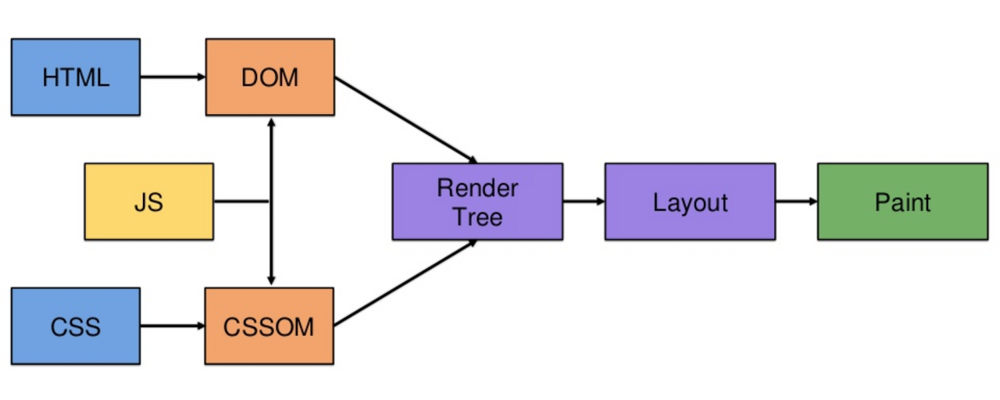

## Apptive 과제 1

- 트랜스파일링 (Transpiling) : 최신 JavaScript(ES6+) 코드를 구버전(ES5)으로 변환하는 과정 

  이유: 브라우저마다 지원하는 JavaScript 버전이 다름 → 구버전 브라우저에서도 코드가 실행되도록 변환해야 함

- 번들링 (Bundling) : 여러 개의 JavaScript 파일을 하나로 묶어주는 과정

  이유: 모듈 시스템(import, export)을 사용하면 파일이 많아짐 → 파일 요청을 줄여 웹사이트 속도를 빠르게 하기 위해 번들링이 필요함

- 폴리필 (Polyfill) : 구버전 브라우저에서 최신 JavaScript 기능을 사용할 수 있도록 도와주는 코드

  이유: 구형 브라우저(예: Internet Explorer)는 최신 JavaScript 기능을 지원하지 않음

패키지 매니저     	 특징				     npm보다 장점
npm			Node.js 기본 패키지 매니저		-
Yarn			페이스북에서 개발		속도가 빠름, 병렬 설치 가능
pnpm		하드 링크 방식 사용		디스크 공간 절약, 더 빠름
Bun			초고속 JS 런타임			npm, Yarn보다 더 빠름

<프로젝트를 생성했을때 나오는 파일들>
package.json		프로젝트 정보, 설치된 패키지 목록
package-lock.json	패키지 버전 고정 (일관된 환경 유지)
node_modules/		설치된 패키지 저장소
public/			HTML, 정적 파일(css, 이미지) 위치
src/				실제 개발하는 코드(React, Vue 등)

<src 내부 폴더 구조>
기본 구조 → components/, styles/
중규모 → pages/, hooks/ 추가
대규모 → api/, store/, utils/까지 포함

## Apptive 과제 2

- 리액트란? JavaScript의 라이브러리로써 복잡한 웹사이트를 더 쉽게 만들수 있도록 도와준다
- 리액트 사용 이유 : 기존의 HTML + CSS + JS 개발 방식은   
             1. 상태(state) 관리가 어렵다  
			 2. 데이터 바뀔때 화면 다시 그리는게 복잡하다  
             3. DOM을 직접 수정해야해서 코드가 길어진다  라는 단점 존재
			 
  리액트를 사용하면 1. 컴포넌트 기반 개발로서 작은 UI (버튼,   네비게이션 등) 조각을 독립적으로 만들고 조합가능
  2. 버튼 클릭했을때 숫자 변하듯이, 변하는 데이터를 쉽게 관리 가능  3. 가상 DOM으로 변경된 부분만 빠르게 
			 업데이트 해서 성능을 높여준다   라는 장점들이 존재함

	  DOM이란?  자바스크립트에서 웹 페이지의 요소를 (HTML 태그) 선택, 수정, 추가 또는 제거할 때 사용된다.

- 명령형 프로그래밍 : 프로그래밍의 데이터와 상태를 변경시키는 구문의 관점에서 연산을 설명하는 프로그래밍 (How의 관점)   
- 선언형 프로그래밍 : 프로그램이 어떤 방법으로 해야 하는지를 나타내기보다 무엇과 같은지를 설명하는 프로그래밍 (What의 관점) 

- 브라우저 렌더링 순서

(HTML,JS,CSS) -> DOM -> Render Tree -> Layout -> Paint

- 랜더링이란 : HTML, CSS, JS로 작성된 문서를 해석하여 브라우저에 시각적으로 출력하는 것

- Server side Rendering : 서버쪽에서 렌더링을 하여 완성된 html을 보내서 화면을 보여주는 방식. 브라우저는 완성된 html을 그대로 받아서 화면에 표시하기에 화면 로딩 속도가 빠르다
- Client side Rendering : 서버에서 받은 데이터를 클라이언트쪽 (브라우저)에서 렌더링 후 화면을 보여주는 방식. 서버는 빈 HTML + JavaScript 파일을 보내고 브라우저가 JS를 실행해서 화면을 띄우기에 화면 로딩 속도가 느리다.