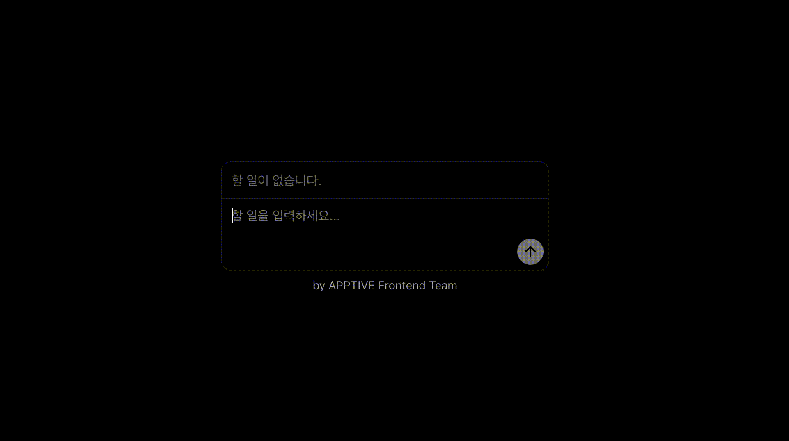

# 과제 1: Todo List 만들기

호영이는 할 일 목록을 기록하는 어플리케이션을 만들고 싶어합니다. 이 어플리케이션은 사용자가 할 일을 추가하고, 완료된 일을 체크하고, 삭제할 수 있는 기능을 제공합니다.

[App.jsx](./src/App.jsx)를 수정해서 어플리케이션을 완성해 봅시다.

## 조건

- 할 일 추가, 완료, 삭제가 전부 동작해야 합니다.
- 리스트가 비어 있을 때는 `<Placeholder />` 렌더링하여야 합니다.

## 힌트

- State 값에 따라 컴포넌트의 표시 여부를 조정할 수 있을까요? **조건부 렌더링**에 대해 알아봅시다.
- State를 사용해서 `Array`를 다룰 때에는 무엇을 조심해야 할까요?
- `Array`에 포함된 여러 개의 데이터를 어떻게 React 컴포넌트로 다룰 수 있을까요?

## 더 알아보기

- 아직 완료되지 않은 할 일의 개수를 표시해 봅시다.
- 완료된 일, 미완료된 일을 탭으로 구분해서 볼 수 있도록 만들어 봅시다.
