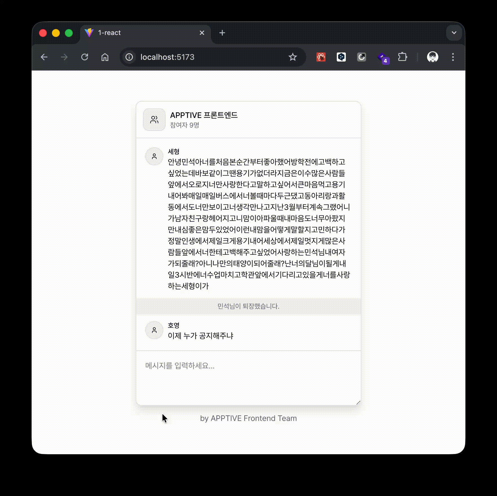

# 과제 2: 게시물 작성 화면 만들기

인성이는 개인 기술 블로그를 운영하고 있습니다.

지금까지는 게시물을 직접 HTML 문서로 작성하여 올리고 있었지만, 게시물의 개수가 너무 많아져서
관리에 어려움을 겪고 있었습니다.

따라서 게시물을 쉽게 작성할 수 있는 게시물 작성 화면을 만들기로 했습니다.

## 요구사항 1

요즘 노안이 왔는지, 어두운 화면에서 글을 읽는 것이 너무 힘들어진 인성이는
라이트 모드와 다크 모드를 전환 가능한 스위치를 화면 상단에 배치하고 싶습니다.

Tailwind CSS의 다크 모드 기능을 활용하려면, `html` 태그에 `class="dark"` 속성을 추가해야 합니다. 이 기능을 기존에 사용하던 `/lib/providers/theme.jsx`에 통합하여 주세요.

## 요구사항 2

게시물 상태를 관리하다 보니, 인성이는 문득 이런 생각이 들었습니다.

> 지금은 제목과 본문만 작성하고 있는데, 나중에 카테고리나 썸네일 이미지 기능이 추가되면
> 상태 관리 코드가 너무 복잡해질 것 같은데?

이렇게 생각한 인성이는 편집기의 상태를 `/lib/providers/editor.jsx`에 Context API를
사용하여 관리하기로 했습니다.

`useEditor` 훅을 사용하여, `components/editor/` 디렉터리에 있는 컴포넌트들에
적절한 상태 관리 로직을 작성하여 주세요. '게시하기' 버튼을 눌렀을 때, 게시물의 제목과 본문이
알림 창에 출력되어야 합니다.

## 더 알아보기

- App.jsx를 분석해서, 인성이가 컴포넌트 합성을 어떻게 했는지 살펴보세요.
- 브라우저 세션 동안 상태를 유지하려면, `sessionStorage` 또는 `localStorage`를 활용해 보세요.
- 어플리케이션 상단에, 본문이 몇 글자인지 실시간으로 표시해 보세요.